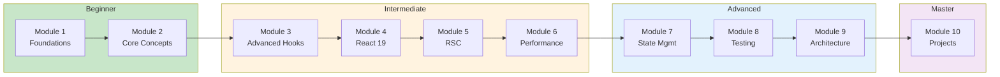

# 🚀 React v19 Learning Curriculum

**From Startup to Master** | A comprehensive, hands-on learning path

---

## 📊 Learning Path

---

## 📘 Modules Overview

| Module | Chapters | Focus Area | Level |
|--------|----------|------------|-------|
| [Module 1](./module-1-foundations/) | 5 | React Foundations | 🟢 Beginner |
| [Module 2](./module-2-core-concepts/) | 5 | Core React Concepts | 🟢 Beginner |
| [Module 3](./module-3-advanced-hooks/) | 4 | Advanced Hooks | 🟡 Intermediate |
| [Module 4](./module-4-react19-features/) | 5 | React 19 New Features | 🟡 Intermediate |
| [Module 5](./module-5-server-components/) | 3 | React Server Components | 🟡 Intermediate |
| [Module 6](./module-6-performance/) | 4 | Performance & Optimization | 🟡 Intermediate |
| [Module 7](./module-7-state-management/) | 5 | State Management | 🔵 Advanced |
| [Module 8](./module-8-testing/) | 6 | Testing Strategies | 🔵 Advanced |
| [Module 9](./module-9-architecture/) | 6 | Architecture & Patterns | 🔵 Advanced |
| [Module 10](./module-10-projects/) | 5 | Real-World Projects | 🟣 Master |

---

## 🎯 Learning Objectives

By completing this curriculum, you will:

### Beginner
- ✅ Build modern React applications using React v19
- ✅ Write JSX and understand its underlying mechanism
- ✅ Create reusable function components
- ✅ Manage component state and handle events

### Intermediate
- ✅ Master both fundamental and advanced hooks
- ✅ Leverage React 19's new features (Actions, `use` API, Server Components)
- ✅ Implement performance optimizations

### Advanced
- ✅ Choose and implement state management solutions
- ✅ Write comprehensive tests for React applications
- ✅ Apply professional architecture patterns

### Master
- ✅ Build production-ready applications
- ✅ Deploy to cloud platforms

---

## 🛠️ Prerequisites

- Basic HTML, CSS, and JavaScript knowledge
- Node.js v18+ installed
- A code editor (VS Code recommended)

---

## 📂 Structure

Each chapter contains:
- 📚 **README.md** - Concepts, code examples, diagrams
- 💻 **examples/** - Runnable code snippets
- ✍️ **exercises/** - Practice problems with solutions

---

## ⏱️ Estimated Time

| Level | Modules | Time |
|-------|---------|------|
| 🟢 Beginner | 1-2 | 8-12 hours |
| 🟡 Intermediate | 3-6 | 15-20 hours |
| 🔵 Advanced | 7-9 | 20-25 hours |
| 🟣 Master | 10 | 10-15 hours |
| **Total** | 1-10 | **50-70 hours** |

---

## 🚦 Getting Started

1. Start with [Module 1: React Foundations](./module-1-foundations/)
2. Complete chapters sequentially within each module
3. Practice with the provided exercises
4. Build the projects in Module 10
5. Deploy your applications!

---

## 📚 Quick Links

### Beginner
- [1.1 Introduction & Setup](./module-1-foundations/1.1-introduction/)
- [1.3 Components & Props](./module-1-foundations/1.3-components-props/)
- [1.4 State with useState](./module-1-foundations/1.4-state-usestate/)

### Intermediate
- [3.1 useContext](./module-3-advanced-hooks/3.1-usecontext/)
- [4.1 Actions & useActionState](./module-4-react19-features/4.1-actions-useactionstate/)
- [5.1 React Server Components](./module-5-server-components/5.1-intro-rsc/)

### Advanced
- [7.2 Zustand](./module-7-state-management/7.2-zustand/)
- [8.3 React Testing Library](./module-8-testing/8.3-react-testing-library/)
- [9.2 Component Patterns](./module-9-architecture/9.2-component-patterns/)

### Projects
- [10.1 Task Manager](./module-10-projects/10.1-task-manager/)
- [10.5 Deployment](./module-10-projects/10.5-deployment/)

---

**Happy Learning! 🎉**
