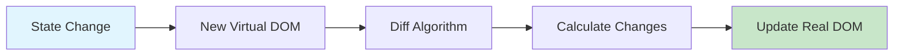
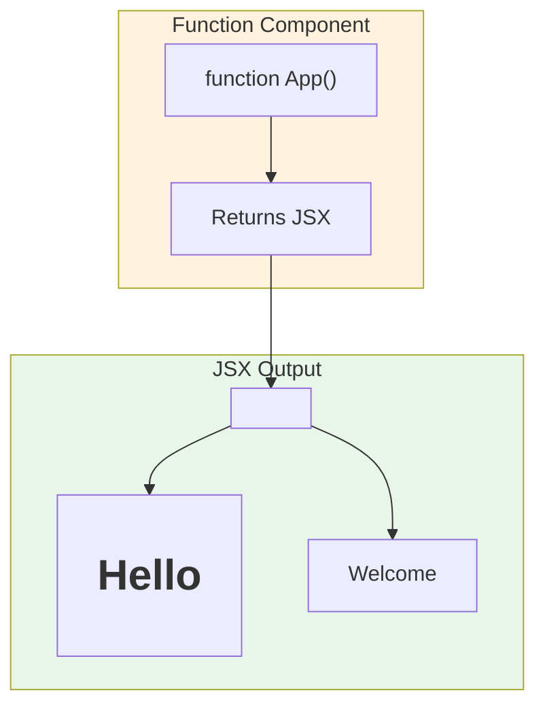

# 1.1 Introduction to React & Setup

## 📚 Learning Objectives

By the end of this chapter, you will:
- Understand what React is and why it's popular
- Learn how the Virtual DOM works
- Set up a React 19 project with Vite
- Create your first React component

---

## 🧠 What is React?

**React** is a JavaScript library for building user interfaces, developed by Meta (Facebook). It follows a **component-based architecture** where UI is broken into small, reusable pieces.

### Key Features

| Feature | Description |
|---------|-------------|
| **Declarative** | Describe what UI should look like, React handles the DOM |
| **Component-Based** | Build encapsulated components that manage their own state |
| **Virtual DOM** | Efficient updates through diffing algorithm |
| **Unidirectional Data Flow** | Data flows down from parent to child |

---

## 🔄 Virtual DOM Explained

The **Virtual DOM** is a lightweight JavaScript representation of the actual DOM. When state changes, React:



### How It Works

1. **State changes** trigger a re-render
2. React creates a **new Virtual DOM tree**
3. **Diff algorithm** compares old and new trees
4. Only the **actual changes** are applied to the real DOM

> [!TIP]
> This approach is much faster than directly manipulating the DOM because batch updates minimize expensive DOM operations.

---

## 🛠️ Project Setup with Vite

**Vite** is a modern build tool that provides fast development experience.

### Step 1: Create a New Project

```bash
# Create a new React project with Vite
npm create vite@latest my-react-app -- --template react

# Navigate to project folder
cd my-react-app

# Install dependencies
npm install

# Start development server
npm run dev
```

### Step 2: Project Structure

```
my-react-app/
├── node_modules/
├── public/
│   └── vite.svg
├── src/
│   ├── App.css
│   ├── App.jsx          # Main component
│   ├── index.css
│   └── main.jsx         # Entry point
├── index.html
├── package.json
└── vite.config.js
```

---

## 💻 Your First Component

Open `src/App.jsx` and replace it with:

```jsx
function App() {
  return (
    <div>
      <h1>Hello, React 19! 🚀</h1>
      <p>Welcome to your first React application.</p>
    </div>
  );
}

export default App;
```

### Understanding the Code



| Part | Explanation |
|------|-------------|
| `function App()` | Defines a function component named `App` |
| `return (...)` | Returns JSX (HTML-like syntax) |
| `export default` | Exports component to use elsewhere |

---

## ✅ Best Practices

1. **Component Naming**: Always use PascalCase (e.g., `MyComponent`)
2. **Single Root**: Components must return a single parent element
3. **File Extension**: Use `.jsx` for files containing JSX
4. **Keep Components Small**: Each component should do one thing well

---

## ⚠️ Common Mistakes

| Mistake | Problem | Solution |
|---------|---------|----------|
| Using `class` | Reserved keyword | Use `className` instead |
| Missing parent element | JSX requires single root | Wrap in `<div>` or `<>` fragment |
| Lowercase component name | Won't render as component | Use PascalCase: `MyComponent` |

---

## 📝 Summary

- React is a **component-based** library for building UIs
- The **Virtual DOM** enables efficient DOM updates
- **Vite** provides fast development setup
- Components are **functions** that return **JSX**

---

## 🏋️ Exercise

Create a component called `Welcome` that displays:
- Your name in an `<h1>` tag
- A brief introduction in a `<p>` tag

See [exercises](./exercises/) for the solution.

---

[← Back to Module 1](../README.md) | [Next: 1.2 JSX Fundamentals →](../1.2-jsx-fundamentals/)
