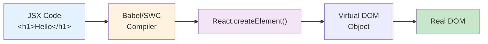

# 1.2 JSX Fundamentals

## 📚 Learning Objectives

By the end of this chapter, you will:
- Understand what JSX is and how it works
- Use expressions and variables in JSX
- Work with fragments and conditional content
- Apply proper TypeScript typing with JSX

---

## 🧠 What is JSX?

**JSX** (JavaScript XML) is a syntax extension that allows you to write HTML-like code in JavaScript/TypeScript. It gets transformed into regular JavaScript function calls.

```tsx
// JSX
const element = <h1>Hello, World!</h1>;

// Transforms to:
const element = React.createElement('h1', null, 'Hello, World!');
```

---

## 🔄 JSX Transformation Flow



---

## 💻 JSX Expressions

You can embed any JavaScript expression in JSX using curly braces `{}`:

```tsx
function Greeting(): React.ReactElement {
  const name: string = "React Developer";
  const currentYear: number = new Date().getFullYear();
  
  return (
    <div>
      <h1>Hello, {name}!</h1>
      <p>Welcome to {currentYear}</p>
      <p>2 + 2 = {2 + 2}</p>
    </div>
  );
}
```

### What Can Go Inside `{}`?

| Expression Type | Example | Valid? |
|-----------------|---------|--------|
| Variables | `{name}` | ✅ |
| Math operations | `{2 + 2}` | ✅ |
| Function calls | `{getName()}` | ✅ |
| Ternary operators | `{isLoggedIn ? 'Yes' : 'No'}` | ✅ |
| Statements (if/for) | `{if (true) {...}}` | ❌ |

---

## 📦 Fragments

React components must return a single parent element. **Fragments** let you group elements without adding extra DOM nodes:

```tsx
// ❌ Error: Adjacent JSX elements must be wrapped
function Bad(): React.ReactElement {
  return (
    <h1>Title</h1>
    <p>Content</p>
  );
}

// ✅ Solution 1: Fragment syntax
function Good1(): React.ReactElement {
  return (
    <>
      <h1>Title</h1>
      <p>Content</p>
    </>
  );
}

// ✅ Solution 2: React.Fragment (useful with keys)
function Good2(): React.ReactElement {
  return (
    <React.Fragment>
      <h1>Title</h1>
      <p>Content</p>
    </React.Fragment>
  );
}
```

---

## 🎨 Attributes in JSX

JSX attributes differ slightly from HTML:

| HTML | JSX | Reason |
|------|-----|--------|
| `class` | `className` | `class` is reserved in JS |
| `for` | `htmlFor` | `for` is reserved in JS |
| `onclick` | `onClick` | camelCase convention |
| `tabindex` | `tabIndex` | camelCase convention |

```tsx
function StyledButton(): React.ReactElement {
  return (
    <button 
      className="primary-btn"
      onClick={() => console.log('Clicked!')}
      disabled={false}
    >
      Click Me
    </button>
  );
}
```

---

## 🔧 Inline Styles

Styles in JSX are objects with camelCase properties:

```tsx
interface StyleObject {
  backgroundColor: string;
  fontSize: string;
  padding: string;
}

function StyledBox(): React.ReactElement {
  const boxStyle: React.CSSProperties = {
    backgroundColor: '#3498db',
    fontSize: '18px',
    padding: '20px',
    borderRadius: '8px'
  };
  
  return <div style={boxStyle}>Styled Box</div>;
}
```

---

## ✅ Best Practices

1. **Always close tags**: Self-closing tags must end with `/>` (e.g., ``)
2. **Use fragments**: Avoid unnecessary wrapper `<div>` elements
3. **Type your components**: Use TypeScript for better IDE support
4. **Extract complex expressions**: Move complex logic outside JSX

```tsx
// ❌ Avoid complex logic in JSX
<p>{users.filter(u => u.active).map(u => u.name).join(', ')}</p>

// ✅ Better: Extract to variable
const activeNames = users.filter(u => u.active).map(u => u.name).join(', ');
<p>{activeNames}</p>
```

---

## ⚠️ Common Mistakes

| Mistake | Issue | Fix |
|---------|-------|-----|
| `class="btn"` | Reserved keyword | `className="btn"` |
| `` | Unclosed tag | `` |
| `{if (x) {...}}` | Statements not allowed | Use ternary `{x ? ... : ...}` |
| `style="color:red"` | String not object | `style={{color: 'red'}}` |

---

## 📝 Summary

- **JSX** is a syntax extension that compiles to `React.createElement()`
- Use **curly braces `{}`** to embed JavaScript expressions
- **Fragments** (`<>...</>`) group elements without extra DOM nodes
- Use **camelCase** for attributes (`className`, `onClick`)
- **Inline styles** are objects with camelCase CSS properties

---

## 🏋️ Exercise

Create a `UserCard` component that displays:
1. A user's name and age using variables
2. Conditional text: "Adult" if age >= 18, else "Minor"
3. Styled with inline styles

See [exercises](./exercises/) for the solution.

---

[← Previous: 1.1 Introduction](../1.1-introduction/) | [Next: 1.3 Components & Props →](../1.3-components-props/)
