# 1.3 Components & Props

## 📚 Learning Objectives

By the end of this chapter, you will:
- Create reusable function components
- Pass data with props and type them with TypeScript
- Compose components together
- Understand React's unidirectional data flow

---

## 🧩 What Are Components?

Components are the building blocks of React applications. Think of them as **custom HTML elements** that encapsulate UI and behavior.


---

## 📦 Creating Components

### Basic Function Component

```tsx
// Greeting.tsx
import React from 'react';

function Greeting(): React.ReactElement {
  return <h1>Hello, React!</h1>;
}

export default Greeting;
```

### Using the Component

```tsx
// App.tsx
import Greeting from './Greeting';

function App(): React.ReactElement {
  return (
    <div>
      <Greeting />
      <Greeting />  {/* Reuse the same component */}
    </div>
  );
}
```

---

## 🎁 Props: Passing Data to Components

**Props** (properties) allow you to pass data from parent to child components.

### Defining Props with TypeScript

```tsx
// UserCard.tsx
import React from 'react';

// Define the shape of props
interface UserCardProps {
  name: string;
  email: string;
  age: number;
  isActive?: boolean;  // Optional prop
}

function UserCard({ name, email, age, isActive = true }: UserCardProps): React.ReactElement {
  return (
    <div className="user-card">
      <h2>{name}</h2>
      <p>Email: {email}</p>
      <p>Age: {age}</p>
      <span>{isActive ? '🟢 Active' : '🔴 Inactive'}</span>
    </div>
  );
}

export default UserCard;
```

### Using Props

```tsx
// App.tsx
import UserCard from './UserCard';

function App(): React.ReactElement {
  return (
    <div>
      <UserCard 
        name="Alice" 
        email="alice@example.com" 
        age={28}
      />
      <UserCard 
        name="Bob" 
        email="bob@example.com" 
        age={35}
        isActive={false}
      />
    </div>
  );
}
```

---

## 🔄 Data Flow Diagram

```mermaid
flowchart TD
    Parent["Parent Component<br/>(owns data)"]
    Child1["Child A<br/>(receives props)"]
    Child2["Child B<br/>(receives props)"]
    
    Parent -->|"props"| Child1
    Parent -->|"props"| Child2
    
    Note["⚠️ Data flows DOWN only<br/>Children cannot modify props"]
    
    style Parent fill:#bbdefb
    style Child1 fill:#c8e6c9
    style Child2 fill:#c8e6c9
    style Note fill:#fff9c4
```



> [!IMPORTANT]
> Props are **read-only**. A child component should never modify the props it receives.

---

## 👶 Children Prop

The special `children` prop allows you to pass components as content:

```tsx
// Card.tsx
import React, { ReactNode } from 'react';

interface CardProps {
  title: string;
  children: ReactNode;  // Accepts any valid React content
}

function Card({ title, children }: CardProps): React.ReactElement {
  return (
    <div className="card">
      <h2>{title}</h2>
      <div className="card-content">
        {children}
      </div>
    </div>
  );
}

export default Card;
```

```tsx
// Usage
<Card title="Welcome">
  <p>This is the card content.</p>
  <button>Click me</button>
</Card>
```

---

## 🧱 Component Composition

Building complex UIs by combining smaller components:

```tsx
// Components
function Avatar({ src, alt }: { src: string; alt: string }): React.ReactElement {
  return ;
}

function UserInfo({ name, role }: { name: string; role: string }): React.ReactElement {
  return (
    <div>
      <h3>{name}</h3>
      <p>{role}</p>
    </div>
  );
}

// Composed Component
interface ProfileProps {
  avatarUrl: string;
  name: string;
  role: string;
}

function Profile({ avatarUrl, name, role }: ProfileProps): React.ReactElement {
  return (
    <div className="profile">
      <Avatar src={avatarUrl} alt={name} />
      <UserInfo name={name} role={role} />
    </div>
  );
}
```

---

## ✅ Best Practices

| Practice | Why |
|----------|-----|
| Use TypeScript interfaces for props | Better IDE support, catches errors early |
| Keep components small | Easier to test and maintain |
| Use destructuring for props | Cleaner, more readable code |
| Provide default values | Makes components more flexible |
| Name components with PascalCase | React convention |

```tsx
// ✅ Good: Typed, destructured, with defaults
interface ButtonProps {
  label: string;
  variant?: 'primary' | 'secondary';
  disabled?: boolean;
}

function Button({ 
  label, 
  variant = 'primary', 
  disabled = false 
}: ButtonProps): React.ReactElement {
  return (
    <button className={`btn btn-${variant}`} disabled={disabled}>
      {label}
    </button>
  );
}
```

---

## ⚠️ Common Mistakes

| Mistake | Problem | Fix |
|---------|---------|-----|
| Modifying props | Props are read-only | Use state for mutable data |
| Missing key types | TypeScript errors | Define interface for all props |
| Huge components | Hard to maintain | Break into smaller components |
| Using `any` type | Loses type safety | Define proper interfaces |

---

## 📝 Summary

- **Components** are reusable, self-contained UI pieces
- **Props** pass data from parent to child (one-way flow)
- Use **TypeScript interfaces** to type your props
- **`children`** prop enables component composition
- Keep components **small** and **focused**

---

## 🏋️ Exercise

Create a `ProductCard` component that:
1. Accepts `name`, `price`, `imageUrl`, and optional `onSale` props
2. Shows a "SALE" badge if `onSale` is true
3. Formats the price with currency symbol

See [exercises](./exercises/) for the solution.

---

[← Previous: 1.2 JSX Fundamentals](../1.2-jsx-fundamentals/) | [Next: 1.4 State with useState →](../1.4-state-usestate/)
