# 1.4 State Management with useState

## 📚 Learning Objectives

By the end of this chapter, you will:
- Understand the difference between props and state
- Use the `useState` hook with TypeScript
- Update state immutably
- Handle derived state and multiple state variables

---

## 🧠 What is State?

**State** is data that can change over time and affects what the component renders.

```mermaid
flowchart LR
    subgraph Props["Props"]
        P["Read-only<br/>Parent → Child<br/>External data"]
    end
    
    subgraph State["State"]
        S["Mutable<br/>Component owns<br/>Internal data"]
    end
    
    Props --> Component
    State --> Component
    Component --> UI["UI Render"]
    
    style Props fill:#e3f2fd
    style State fill:#fff3e0
    style UI fill:#c8e6c9
```



| Props | State |
|-------|-------|
| Passed from parent | Declared within component |
| Read-only | Can be updated |
| Changes trigger re-render | Changes trigger re-render |

---

## 🎣 The useState Hook

### Basic Syntax

```tsx
import { useState } from 'react';

function Counter(): React.ReactElement {
  // [currentValue, setterFunction] = useState(initialValue)
  const [count, setCount] = useState<number>(0);
  
  return (
    <div>
      <p>Count: {count}</p>
      <button onClick={() => setCount(count + 1)}>
        Increment
      </button>
    </div>
  );
}
```

### How useState Works


---

## 📘 TypeScript with useState

### Primitive Types

```tsx
// String state
const [name, setName] = useState<string>('');

// Number state
const [age, setAge] = useState<number>(0);

// Boolean state
const [isActive, setIsActive] = useState<boolean>(false);
```

### Object State

```tsx
interface User {
  name: string;
  email: string;
  age: number;
}

function UserForm(): React.ReactElement {
  const [user, setUser] = useState<User>({
    name: '',
    email: '',
    age: 0
  });
  
  // Update single property (immutably!)
  const updateName = (name: string): void => {
    setUser(prevUser => ({
      ...prevUser,
      name
    }));
  };
  
  return (
    <input 
      value={user.name}
      onChange={(e) => updateName(e.target.value)}
    />
  );
}
```

### Array State

```tsx
interface Todo {
  id: number;
  text: string;
  completed: boolean;
}

function TodoList(): React.ReactElement {
  const [todos, setTodos] = useState<Todo[]>([]);
  
  // Add item
  const addTodo = (text: string): void => {
    const newTodo: Todo = {
      id: Date.now(),
      text,
      completed: false
    };
    setTodos(prev => [...prev, newTodo]);
  };
  
  // Remove item
  const removeTodo = (id: number): void => {
    setTodos(prev => prev.filter(todo => todo.id !== id));
  };
  
  // Toggle item
  const toggleTodo = (id: number): void => {
    setTodos(prev => 
      prev.map(todo => 
        todo.id === id 
          ? { ...todo, completed: !todo.completed }
          : todo
      )
    );
  };
  
  return (
    <ul>
      {todos.map(todo => (
        <li key={todo.id}>
          <span style={{ 
            textDecoration: todo.completed ? 'line-through' : 'none' 
          }}>
            {todo.text}
          </span>
        </li>
      ))}
    </ul>
  );
}
```

---

## 🔄 Immutable Updates

> [!CAUTION]
> Never mutate state directly! Always create new values.

```tsx
// ❌ WRONG: Mutating state directly
const addItem = (item: string): void => {
  items.push(item);  // Mutation!
  setItems(items);   // React won't detect change
};

// ✅ CORRECT: Creating new array
const addItem = (item: string): void => {
  setItems([...items, item]);  // New array
};

// ❌ WRONG: Mutating object
user.name = 'New Name';
setUser(user);

// ✅ CORRECT: Creating new object
setUser({ ...user, name: 'New Name' });
```

### Common Immutable Patterns

| Operation | Pattern |
|-----------|---------|
| Add to array | `[...prev, newItem]` |
| Remove from array | `prev.filter(x => x.id !== id)` |
| Update in array | `prev.map(x => x.id === id ? {...x, ...updates} : x)` |
| Update object property | `{...prev, key: newValue}` |

---

## 🔢 Multiple State Variables

```tsx
function Profile(): React.ReactElement {
  const [name, setName] = useState<string>('');
  const [age, setAge] = useState<number>(0);
  const [hobbies, setHobbies] = useState<string[]>([]);
  
  // Each has its own setter
  return (
    <div>
      <input 
        value={name} 
        onChange={(e) => setName(e.target.value)} 
      />
      <input 
        type="number"
        value={age} 
        onChange={(e) => setAge(Number(e.target.value))} 
      />
    </div>
  );
}
```

---

## 🔄 Functional Updates

When new state depends on previous state, use the functional form:

```tsx
// ❌ May cause issues with batching
setCount(count + 1);
setCount(count + 1);  // Still uses old count!

// ✅ Always uses latest state
setCount(prev => prev + 1);
setCount(prev => prev + 1);  // Works correctly!
```

---

## ✅ Best Practices

| Practice | Example |
|----------|---------|
| Type your state | `useState<number>(0)` |
| Use functional updates | `setCount(prev => prev + 1)` |
| Keep state minimal | Don't duplicate derived data |
| Lift state when shared | Move to common ancestor |
| Initialize with proper defaults | `useState<string[]>([])` not `undefined` |

---

## ⚠️ Common Mistakes

| Mistake | Problem | Fix |
|---------|---------|-----|
| Mutating state | No re-render | Create new objects/arrays |
| Wrong type inference | Type errors | Explicit generic: `useState<Type>()` |
| State not updating | Using stale value | Use functional update |
| Too many re-renders | Unnecessary state | Derive values instead |

---

## 📝 Summary

- **State** is mutable data owned by a component
- **useState** returns `[value, setter]` tuple
- Always **type your state** with TypeScript generics
- **Never mutate** state directly—create new values
- Use **functional updates** when new state depends on old state

---

## 🏋️ Exercise

Create a `ShoppingCart` component that:
1. Manages an array of cart items (id, name, quantity, price)
2. Allows adding/removing items
3. Calculates total price (derived state)
4. Shows item count badge

See [exercises](./exercises/) for the solution.

---

[← Previous: 1.3 Components & Props](../1.3-components-props/) | [Next: 1.5 Event Handling →](../1.5-event-handling/)
