# 1.5 Event Handling

## 📚 Learning Objectives

By the end of this chapter, you will:
- Handle DOM events in React with TypeScript
- Use proper event types for type safety
- Pass arguments to event handlers
- Understand synthetic events

---

## 🎯 React Event Handling

React uses **Synthetic Events** - a cross-browser wrapper around native DOM events. Event handlers are passed as props using camelCase naming.

```mermaid
flowchart LR
    User["👆 User Click"] --> SE["Synthetic Event"]
    SE --> Handler["onClick Handler"]
    Handler --> State["Update State"]
    State --> Render["Re-render UI"]
    
    style SE fill:#e3f2fd
    style Handler fill:#fff3e0
    style State fill:#c8e6c9
```



---

## 💻 Basic Event Handling

### Click Events

```tsx
import React, { useState } from 'react';

function ClickCounter(): React.ReactElement {
  const [count, setCount] = useState<number>(0);
  
  // Event handler with proper type
  const handleClick = (event: React.MouseEvent<HTMLButtonElement>): void => {
    console.log('Button clicked!', event.target);
    setCount(prev => prev + 1);
  };
  
  return (
    <button onClick={handleClick}>
      Clicked {count} times
    </button>
  );
}
```

### Common Event Handler Types

| Event | Handler Type | Use Case |
|-------|--------------|----------|
| Click | `React.MouseEvent<HTMLButtonElement>` | Button clicks |
| Change | `React.ChangeEvent<HTMLInputElement>` | Input changes |
| Submit | `React.FormEvent<HTMLFormElement>` | Form submission |
| Keyboard | `React.KeyboardEvent<HTMLInputElement>` | Key presses |
| Focus | `React.FocusEvent<HTMLInputElement>` | Focus/blur |
| Mouse | `React.MouseEvent<HTMLDivElement>` | Hover, drag |

---

## 📝 Form Events

### Input Change Events

```tsx
function TextInput(): React.ReactElement {
  const [value, setValue] = useState<string>('');
  
  const handleChange = (event: React.ChangeEvent<HTMLInputElement>): void => {
    setValue(event.target.value);
  };
  
  return (
    <input 
      type="text"
      value={value}
      onChange={handleChange}
      placeholder="Type something..."
    />
  );
}
```

### Form Submit Events

```tsx
interface LoginForm {
  email: string;
  password: string;
}

function LoginForm(): React.ReactElement {
  const [formData, setFormData] = useState<LoginForm>({
    email: '',
    password: ''
  });
  
  const handleSubmit = (event: React.FormEvent<HTMLFormElement>): void => {
    event.preventDefault();  // Prevent page reload
    console.log('Form submitted:', formData);
  };
  
  const handleChange = (event: React.ChangeEvent<HTMLInputElement>): void => {
    const { name, value } = event.target;
    setFormData(prev => ({
      ...prev,
      [name]: value
    }));
  };
  
  return (
    <form onSubmit={handleSubmit}>
      <input 
        name="email"
        type="email"
        value={formData.email}
        onChange={handleChange}
      />
      <input 
        name="password"
        type="password"
        value={formData.password}
        onChange={handleChange}
      />
      <button type="submit">Login</button>
    </form>
  );
}
```

---

## 🎹 Keyboard Events

```tsx
function KeyboardDemo(): React.ReactElement {
  const handleKeyDown = (event: React.KeyboardEvent<HTMLInputElement>): void => {
    if (event.key === 'Enter') {
      console.log('Enter pressed!');
    }
    if (event.key === 'Escape') {
      console.log('Escape pressed!');
    }
  };
  
  const handleKeyWithModifier = (event: React.KeyboardEvent<HTMLInputElement>): void => {
    if (event.ctrlKey && event.key === 's') {
      event.preventDefault();
      console.log('Ctrl+S pressed!');
    }
  };
  
  return (
    <input 
      onKeyDown={handleKeyDown}
      placeholder="Press Enter or Escape"
    />
  );
}
```

---

## 📦 Passing Arguments to Handlers

### Method 1: Arrow Function in JSX

```tsx
interface Item {
  id: number;
  name: string;
}

function ItemList(): React.ReactElement {
  const items: Item[] = [
    { id: 1, name: 'Apple' },
    { id: 2, name: 'Banana' },
    { id: 3, name: 'Cherry' }
  ];
  
  const handleDelete = (id: number): void => {
    console.log('Deleting item:', id);
  };
  
  return (
    <ul>
      {items.map(item => (
        <li key={item.id}>
          {item.name}
          {/* Arrow function passes the argument */}
          <button onClick={() => handleDelete(item.id)}>
            Delete
          </button>
        </li>
      ))}
    </ul>
  );
}
```

### Method 2: Handler Factory Function

```tsx
function ItemListOptimized(): React.ReactElement {
  const items: Item[] = [
    { id: 1, name: 'Apple' },
    { id: 2, name: 'Banana' }
  ];
  
  // Returns a handler function
  const createDeleteHandler = (id: number) => {
    return (event: React.MouseEvent<HTMLButtonElement>): void => {
      console.log('Deleting:', id);
    };
  };
  
  return (
    <ul>
      {items.map(item => (
        <li key={item.id}>
          {item.name}
          <button onClick={createDeleteHandler(item.id)}>Delete</button>
        </li>
      ))}
    </ul>
  );
}
```

---

## 🔄 Event Flow Diagram

```mermaid
flowchart TB
    subgraph Capture["Capture Phase ⬇️"]
        D1["document"] --> P1["parent"]
        P1 --> T["target"]
    end
    
    subgraph Bubble["Bubble Phase ⬆️"]
        T2["target"] --> P2["parent"]
        P2 --> D2["document"]
    end
    
    T --> T2
    
    style Capture fill:#e3f2fd
    style Bubble fill:#fff3e0
```



### Stopping Propagation

```tsx
function ParentChild(): React.ReactElement {
  const handleParentClick = (): void => {
    console.log('Parent clicked');
  };
  
  const handleChildClick = (event: React.MouseEvent<HTMLButtonElement>): void => {
    event.stopPropagation();  // Prevents bubbling to parent
    console.log('Child clicked');
  };
  
  return (
    <div onClick={handleParentClick}>
      <button onClick={handleChildClick}>
        Click me (won't bubble)
      </button>
    </div>
  );
}
```

---

## ✅ Best Practices

| Practice | Example |
|----------|---------|
| Always type events | `React.MouseEvent<HTMLButtonElement>` |
| Prevent default when needed | `event.preventDefault()` |
| Use named handlers | `handleClick` not inline `() => {}` |
| Avoid re-creating handlers | Use `useCallback` for expensive handlers |

```tsx
// ✅ Good: Named handler with types
const handleSubmit = (event: React.FormEvent<HTMLFormElement>): void => {
  event.preventDefault();
  // logic here
};

// ❌ Avoid: Anonymous functions for complex logic
<button onClick={(e) => {
  // lots of logic...
}}>Click</button>
```

---

## ⚠️ Common Mistakes

| Mistake | Problem | Fix |
|---------|---------|-----|
| Calling function directly | `onClick={handleClick()}` | `onClick={handleClick}` |
| Wrong event type | Type errors | Use correct `React.*Event` |
| Missing `preventDefault` | Form reloads page | Add `event.preventDefault()` |
| Forgetting to type `event` | No autocomplete | Add proper event type |

---

## 📝 Summary

- React uses **Synthetic Events** for cross-browser compatibility
- Use **camelCase** for event props: `onClick`, `onChange`, `onSubmit`
- Always **type your events** with TypeScript for safety
- Use `event.preventDefault()` for forms
- Use **arrow functions** or **handler factories** to pass arguments

---

## 🏋️ Exercise

Create a `SearchBox` component that:
1. Has an input with `onChange` for real-time search
2. Shows "Searching..." when the user types
3. Clears the input when pressing Escape
4. Submits on Enter key press

See [exercises](./exercises/) for the solution.

---

[← Previous: 1.4 State with useState](../1.4-state-usestate/) | [Next Module: 2. Core Concepts →](../../module-2-core-concepts/)
