# 2.1 Component Lifecycle & useEffect

## 📚 Learning Objectives

By the end of this chapter, you will:
- Understand component lifecycle phases
- Use `useEffect` for side effects
- Handle cleanup functions properly
- Master the dependency array

---

## 🔄 Component Lifecycle

React function components go through distinct phases:

```mermaid
flowchart LR
    Mount["🟢 Mount<br/>(Created)"] --> Update["🔄 Update<br/>(Re-render)"]
    Update --> Update
    Update --> Unmount["🔴 Unmount<br/>(Destroyed)"]
    
    style Mount fill:#c8e6c9
    style Update fill:#fff3e0
    style Unmount fill:#ffcdd2
```



| Phase | When | useEffect Behavior |
|-------|------|-------------------|
| **Mount** | Component first appears | Effect runs |
| **Update** | State/props change | Effect runs (if deps changed) |
| **Unmount** | Component removed | Cleanup runs |

---

## 🎣 The useEffect Hook

`useEffect` lets you perform side effects in function components.

### Basic Syntax

```tsx
import { useEffect, useState } from 'react';

function Example(): React.ReactElement {
  const [count, setCount] = useState<number>(0);
  
  useEffect(() => {
    // Side effect code runs after render
    document.title = `Count: ${count}`;
    
    // Optional: cleanup function
    return () => {
      document.title = 'React App';
    };
  }, [count]); // Dependency array
  
  return <button onClick={() => setCount(c => c + 1)}>{count}</button>;
}
```

---

## 📦 Dependency Array Patterns


### Pattern Examples

```tsx
// 1. Run on EVERY render (rarely needed)
useEffect(() => {
  console.log('Rendered!');
});

// 2. Run ONCE on mount
useEffect(() => {
  console.log('Component mounted!');
}, []);

// 3. Run when specific values change
useEffect(() => {
  console.log('Count changed to:', count);
}, [count]);

// 4. Run when ANY of multiple values change
useEffect(() => {
  console.log('User or count changed');
}, [user, count]);
```

---

## 🧹 Cleanup Function

The cleanup function runs:
- Before the effect runs again
- When the component unmounts

### Subscription Example

```tsx
function ChatRoom({ roomId }: { roomId: string }): React.ReactElement {
  const [messages, setMessages] = useState<string[]>([]);
  
  useEffect(() => {
    // Setup: subscribe to room
    const connection = createConnection(roomId);
    connection.connect();
    
    connection.onMessage((msg: string) => {
      setMessages(prev => [...prev, msg]);
    });
    
    // Cleanup: unsubscribe when roomId changes or unmount
    return () => {
      connection.disconnect();
    };
  }, [roomId]);
  
  return <div>{messages.map((msg, i) => <p key={i}>{msg}</p>)}</div>;
}
```

### Timer Example

```tsx
function Timer(): React.ReactElement {
  const [seconds, setSeconds] = useState<number>(0);
  
  useEffect(() => {
    const intervalId = setInterval(() => {
      setSeconds(prev => prev + 1);
    }, 1000);
    
    // Cleanup: stop timer
    return () => {
      clearInterval(intervalId);
    };
  }, []); // Empty array = runs once
  
  return <p>Seconds: {seconds}</p>;
}
```

---

## 📡 Data Fetching

Common pattern for API calls:

```tsx
interface User {
  id: number;
  name: string;
  email: string;
}

function UserProfile({ userId }: { userId: number }): React.ReactElement {
  const [user, setUser] = useState<User | null>(null);
  const [loading, setLoading] = useState<boolean>(true);
  const [error, setError] = useState<string | null>(null);
  
  useEffect(() => {
    let cancelled = false;
    
    const fetchUser = async (): Promise<void> => {
      try {
        setLoading(true);
        const response = await fetch(`/api/users/${userId}`);
        const data: User = await response.json();
        
        if (!cancelled) {
          setUser(data);
          setError(null);
        }
      } catch (err) {
        if (!cancelled) {
          setError('Failed to fetch user');
        }
      } finally {
        if (!cancelled) {
          setLoading(false);
        }
      }
    };
    
    fetchUser();
    
    // Cleanup: prevent state updates if component unmounts
    return () => {
      cancelled = true;
    };
  }, [userId]);
  
  if (loading) return <p>Loading...</p>;
  if (error) return <p>Error: {error}</p>;
  if (!user) return <p>No user found</p>;
  
  return (
    <div>
      <h2>{user.name}</h2>
      <p>{user.email}</p>
    </div>
  );
}
```

---

## 📊 Effect Execution Flow


---

## ✅ Best Practices

| Practice | Why |
|----------|-----|
| Always specify dependencies | Prevents stale closures |
| Use cleanup for subscriptions | Prevents memory leaks |
| Handle cancelled requests | Prevents state updates on unmount |
| Don't lie about dependencies | Causes bugs |
| Extract logic to custom hooks | Reusability |

---

## ⚠️ Common Mistakes

| Mistake | Problem | Fix |
|---------|---------|-----|
| Missing dependencies | Stale values | Add all used values to array |
| Object/array in deps | Runs every render | Memoize or use primitives |
| Forgetting cleanup | Memory leaks | Return cleanup function |
| Async effect directly | Not allowed | Use async function inside |

```tsx
// ❌ WRONG: async directly
useEffect(async () => {
  await fetchData();
}, []);

// ✅ CORRECT: async inside
useEffect(() => {
  const fetchData = async () => {
    await fetch('/api/data');
  };
  fetchData();
}, []);
```

---

## 📝 Summary

- **useEffect** handles side effects after render
- **Cleanup function** runs before re-running or unmounting
- **Dependency array** controls when effect runs
- Empty `[]` = mount only; no array = every render
- Always **clean up** subscriptions, timers, and listeners

---

## 🏋️ Exercise

Create a `LiveClock` component that:
1. Displays current time, updating every second
2. Properly cleans up the interval on unmount
3. Allows pausing/resuming the clock

See [exercises](./exercises/) for the solution.

---

[← Back to Module 2](../README.md) | [Next: 2.2 Conditional Rendering →](../2.2-conditional-rendering/)
