# 2.2 Conditional Rendering

## 📚 Learning Objectives

By the end of this chapter, you will:
- Render components conditionally based on state
- Use ternary operators, `&&`, and early returns
- Handle null/undefined states gracefully
- Apply best practices for readable conditionals

---

## 🔀 Conditional Rendering Patterns

```mermaid
flowchart TB
    subgraph Patterns["Conditional Patterns"]
        T["Ternary<br/>condition ? A : B"]
        A["Logical &&<br/>condition && A"]
        E["Early Return<br/>if (!x) return null"]
        S["Switch/Object<br/>status → component"]
    end
    
    style T fill:#e3f2fd
    style A fill:#fff3e0
    style E fill:#e8f5e9
    style S fill:#f3e5f5
```



---

## 1️⃣ Ternary Operator

Best for **either/or** situations:

```tsx
interface UserStatusProps {
  isLoggedIn: boolean;
  username?: string;
}

function UserStatus({ isLoggedIn, username }: UserStatusProps): React.ReactElement {
  return (
    <div>
      {isLoggedIn ? (
        <p>Welcome back, {username}!</p>
      ) : (
        <p>Please log in</p>
      )}
    </div>
  );
}
```

---

## 2️⃣ Logical AND (&&)

Best for **show or nothing** situations:

```tsx
interface NotificationBadgeProps {
  count: number;
}

function NotificationBadge({ count }: NotificationBadgeProps): React.ReactElement {
  return (
    <div>
      <span>🔔 Notifications</span>
      {count > 0 && (
        <span className="badge">{count}</span>
      )}
    </div>
  );
}
```

> [!WARNING]
> Be careful with `0 && <Component />` — it renders `0`!
> Use `count > 0 && ...` instead of `count && ...`

```tsx
// ❌ Bug: renders "0" when count is 0
{count && <Badge count={count} />}

// ✅ Correct: renders nothing when count is 0
{count > 0 && <Badge count={count} />}
```

---

## 3️⃣ Early Return

Best for **guard conditions** and loading states:

```tsx
interface User {
  name: string;
  email: string;
}

interface UserProfileProps {
  user: User | null;
  loading: boolean;
  error: string | null;
}

function UserProfile({ user, loading, error }: UserProfileProps): React.ReactElement | null {
  // Guard: loading state
  if (loading) {
    return <div className="spinner">Loading...</div>;
  }
  
  // Guard: error state
  if (error) {
    return <div className="error">Error: {error}</div>;
  }
  
  // Guard: null check
  if (!user) {
    return <div>No user found</div>;
  }
  
  // Main render
  return (
    <div className="profile">
      <h2>{user.name}</h2>
      <p>{user.email}</p>
    </div>
  );
}
```

---

## 4️⃣ Switch/Object Lookup

Best for **multiple states**:

```tsx
type Status = 'idle' | 'loading' | 'success' | 'error';

interface StatusMessageProps {
  status: Status;
  data?: string;
  errorMessage?: string;
}

function StatusMessage({ status, data, errorMessage }: StatusMessageProps): React.ReactElement {
  const statusComponents: Record<Status, React.ReactElement> = {
    idle: <p>Ready to start</p>,
    loading: <p>⏳ Loading...</p>,
    success: <p>✅ Success: {data}</p>,
    error: <p>❌ Error: {errorMessage}</p>
  };
  
  return <div>{statusComponents[status]}</div>;
}
```

---

## 🔄 Conditional Rendering Flow


---

## 📦 Conditional CSS Classes

```tsx
interface ButtonProps {
  variant: 'primary' | 'secondary' | 'danger';
  disabled?: boolean;
  children: React.ReactNode;
}

function Button({ variant, disabled = false, children }: ButtonProps): React.ReactElement {
  // Method 1: Template literals
  const className = `btn btn-${variant} ${disabled ? 'btn-disabled' : ''}`;
  
  // Method 2: Array join (cleaner)
  const classNames = [
    'btn',
    `btn-${variant}`,
    disabled && 'btn-disabled'
  ].filter(Boolean).join(' ');
  
  return (
    <button className={classNames} disabled={disabled}>
      {children}
    </button>
  );
}
```

---

## ✅ Best Practices

| Situation | Use |
|-----------|-----|
| Either A or B | Ternary `? :` |
| Show or nothing | Logical `&&` |
| Multiple checks | Early returns |
| Many states (3+) | Switch/Object lookup |
| Complex conditions | Extract to variable or function |

```tsx
// ✅ Good: Extract complex conditions
const canSubmit = isValid && !loading && hasChanges;
return <button disabled={!canSubmit}>Submit</button>;

// ❌ Avoid: Inline complex conditions
return <button disabled={!isValid || loading || !hasChanges}>Submit</button>;
```

---

## ⚠️ Common Mistakes

| Mistake | Problem | Fix |
|---------|---------|-----|
| `0 && <X />` | Renders `0` | Use `count > 0 && <X />` |
| Nested ternaries | Hard to read | Use early returns |
| Missing null check | Crashes | Add guard `if (!data)` |
| Inline complex logic | Unreadable | Extract to variable |

---

## 📝 Summary

- **Ternary** (`? :`) for either/or rendering
- **Logical &&** for show-or-nothing (watch for `0`!)
- **Early returns** for guard conditions and loading states
- **Object lookup** for multiple state variations
- Always **extract complex conditions** for readability

---

## 🏋️ Exercise

Create a `PaymentStatus` component that:
1. Shows different UI based on status: `pending`, `processing`, `success`, `failed`
2. Uses appropriate conditional patterns
3. Has retry button only for `failed` status

See [exercises](./exercises/) for the solution.

---

[← Previous: 2.1 useEffect](../2.1-useeffect-lifecycle/) | [Next: 2.3 Lists and Keys →](../2.3-lists-keys/)
