# 2.3 Lists and Keys

## 📚 Learning Objectives

By the end of this chapter, you will:
- Render arrays of data as React elements
- Understand why keys are necessary
- Choose appropriate key values
- Avoid common key-related bugs

---

## 🔄 Rendering Lists

Use JavaScript's `map()` to transform arrays into React elements:

```tsx
interface Fruit {
  id: number;
  name: string;
  emoji: string;
}

function FruitList(): React.ReactElement {
  const fruits: Fruit[] = [
    { id: 1, name: 'Apple', emoji: '🍎' },
    { id: 2, name: 'Banana', emoji: '🍌' },
    { id: 3, name: 'Cherry', emoji: '🍒' }
  ];
  
  return (
    <ul>
      {fruits.map(fruit => (
        <li key={fruit.id}>
          {fruit.emoji} {fruit.name}
        </li>
      ))}
    </ul>
  );
}
```

---

## 🔑 Understanding Keys

Keys help React identify which items have changed, been added, or removed.

```mermaid
flowchart TB
    subgraph Without["Without Keys"]
        W1["Item A"] --> WX["❓ Which updated?"]
        W2["Item B"] --> WX
        W3["Item C"] --> WX
    end
    
    subgraph With["With Keys"]
        K1["key=1: Item A"] --> KX["✅ Track by key"]
        K2["key=2: Item B"] --> KX
        K3["key=3: Item C"] --> KX
    end
    
    style Without fill:#ffcdd2
    style With fill:#c8e6c9
```



### How React Uses Keys


---

## ✅ Good vs Bad Keys

| Key Source | Good? | Why |
|------------|-------|-----|
| Database ID | ✅ | Unique, stable |
| UUID | ✅ | Unique, stable |
| Index | ⚠️ | Unstable with reordering |
| Random | ❌ | Changes every render |
| Content | ⚠️ | May not be unique |

```tsx
// ✅ GOOD: Unique, stable ID
{users.map(user => (
  <UserCard key={user.id} user={user} />
))}

// ⚠️ OKAY if list is static and never reorders
{staticItems.map((item, index) => (
  <li key={index}>{item}</li>
))}

// ❌ BAD: New key every render
{items.map(item => (
  <li key={Math.random()}>{item.name}</li>
))}
```

---

## 📦 Practical Examples

### 1. Simple List Rendering

```tsx
interface Task {
  id: string;
  text: string;
  completed: boolean;
}

function TaskList(): React.ReactElement {
  const [tasks, setTasks] = useState<Task[]>([
    { id: 'a1', text: 'Learn React', completed: true },
    { id: 'b2', text: 'Build project', completed: false },
    { id: 'c3', text: 'Deploy app', completed: false }
  ]);
  
  return (
    <ul>
      {tasks.map(task => (
        <li 
          key={task.id}
          style={{ textDecoration: task.completed ? 'line-through' : 'none' }}
        >
          {task.text}
        </li>
      ))}
    </ul>
  );
}
```

### 2. List with Components

```tsx
interface Product {
  id: number;
  name: string;
  price: number;
}

interface ProductCardProps {
  product: Product;
  onAddToCart: (id: number) => void;
}

function ProductCard({ product, onAddToCart }: ProductCardProps): React.ReactElement {
  return (
    <div className="product-card">
      <h3>{product.name}</h3>
      <p>${product.price.toFixed(2)}</p>
      <button onClick={() => onAddToCart(product.id)}>
        Add to Cart
      </button>
    </div>
  );
}

function ProductGrid(): React.ReactElement {
  const products: Product[] = [
    { id: 1, name: 'Laptop', price: 999.99 },
    { id: 2, name: 'Phone', price: 699.99 },
    { id: 3, name: 'Tablet', price: 499.99 }
  ];
  
  const handleAddToCart = (id: number): void => {
    console.log('Added product:', id);
  };
  
  return (
    <div className="product-grid">
      {products.map(product => (
        <ProductCard 
          key={product.id}
          product={product}
          onAddToCart={handleAddToCart}
        />
      ))}
    </div>
  );
}
```

### 3. Nested Lists

```tsx
interface Category {
  id: number;
  name: string;
  items: { id: number; name: string }[];
}

function NestedList(): React.ReactElement {
  const categories: Category[] = [
    { id: 1, name: 'Fruits', items: [{ id: 101, name: 'Apple' }, { id: 102, name: 'Banana' }] },
    { id: 2, name: 'Vegetables', items: [{ id: 201, name: 'Carrot' }, { id: 202, name: 'Broccoli' }] }
  ];
  
  return (
    <div>
      {categories.map(category => (
        <div key={category.id}>
          <h2>{category.name}</h2>
          <ul>
            {category.items.map(item => (
              <li key={item.id}>{item.name}</li>
            ))}
          </ul>
        </div>
      ))}
    </div>
  );
}
```

---

## 🚫 Index as Key Problem

```tsx
// Initial render
['A', 'B', 'C'].map((item, idx) => <Input key={idx} defaultValue={item} />)
// Keys: 0='A', 1='B', 2='C'

// After removing 'B'
['A', 'C'].map((item, idx) => <Input key={idx} defaultValue={item} />)
// Keys: 0='A', 1='C'  ← Key 1 now has C's value but B's internal state!
```

> [!CAUTION]
> Using index as key causes bugs when:
> - Items can be reordered
> - Items can be inserted/deleted
> - Items have internal state (inputs, selections)

---

## ✅ Best Practices

| Practice | Why |
|----------|-----|
| Use unique IDs as keys | Stable identity across renders |
| Keep keys among siblings | Keys only need to be unique among siblings |
| Don't generate keys in render | Creates new keys every render |
| Pass key to outermost element | The mapped element needs the key |

```tsx
// ✅ Key on the component, not internal elements
{items.map(item => (
  <ItemComponent key={item.id} item={item} />
))}

// ❌ Wrong: key on internal element
{items.map(item => (
  <ItemComponent item={item}>
    <div key={item.id}>...</div>  {/* Key in wrong place */}
  </ItemComponent>
))}
```

---

## 📝 Summary

- Use `map()` to render arrays as React elements
- **Keys** help React track items efficiently
- Use **stable, unique IDs** as keys
- Avoid **index as key** when list can change
- Keys only need to be **unique among siblings**

---

## 🏋️ Exercise

Create a `ContactList` component that:
1. Renders a list of contacts (name, email, avatar)
2. Supports adding and removing contacts
3. Uses proper keys
4. Shows "No contacts" when empty

See [exercises](./exercises/) for the solution.

---

[← Previous: 2.2 Conditional Rendering](../2.2-conditional-rendering/) | [Next: 2.4 Forms →](../2.4-forms/)
