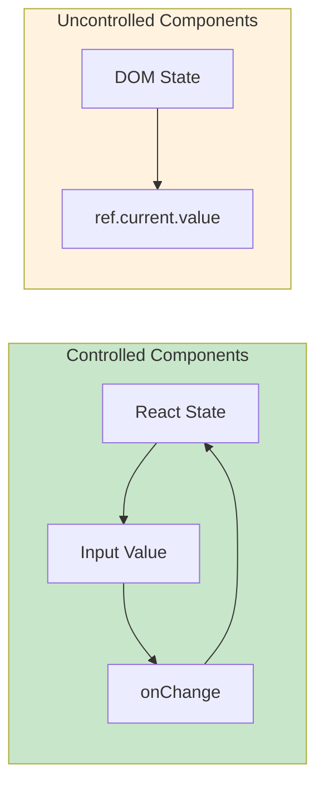
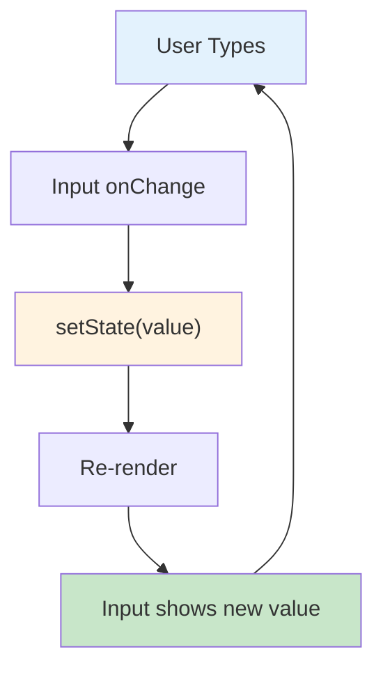

# 2.4 Forms and Controlled Components

## 📚 Learning Objectives

By the end of this chapter, you will:
- Build controlled form components
- Handle various input types with TypeScript
- Implement form validation
- Manage complex form state

---

## 🎮 Controlled vs Uncontrolled



| Approach | State Lives In | Best For |
|----------|---------------|----------|
| Controlled | React state | Dynamic forms, validation |
| Uncontrolled | DOM | Simple forms, file inputs |

---

## 📝 Basic Controlled Input

```tsx
import { useState } from 'react';

function SimpleForm(): React.ReactElement {
  const [name, setName] = useState<string>('');
  
  const handleChange = (event: React.ChangeEvent<HTMLInputElement>): void => {
    setName(event.target.value);
  };
  
  return (
    <input
      type="text"
      value={name}
      onChange={handleChange}
      placeholder="Enter your name"
    />
  );
}
```

---

## 📋 Complete Form Example

```tsx
interface FormData {
  firstName: string;
  lastName: string;
  email: string;
  password: string;
  age: number;
  gender: 'male' | 'female' | 'other' | '';
  country: string;
  bio: string;
  newsletter: boolean;
  terms: boolean;
}

function RegistrationForm(): React.ReactElement {
  const [formData, setFormData] = useState<FormData>({
    firstName: '',
    lastName: '',
    email: '',
    password: '',
    age: 0,
    gender: '',
    country: '',
    bio: '',
    newsletter: false,
    terms: false
  });

  const handleChange = (
    event: React.ChangeEvent<HTMLInputElement | HTMLSelectElement | HTMLTextAreaElement>
  ): void => {
    const { name, value, type } = event.target;
    
    setFormData(prev => ({
      ...prev,
      [name]: type === 'checkbox' 
        ? (event.target as HTMLInputElement).checked
        : type === 'number'
          ? Number(value)
          : value
    }));
  };

  const handleSubmit = (event: React.FormEvent<HTMLFormElement>): void => {
    event.preventDefault();
    console.log('Form submitted:', formData);
  };

  return (
    <form onSubmit={handleSubmit}>
      {/* Text inputs */}
      <input
        name="firstName"
        type="text"
        value={formData.firstName}
        onChange={handleChange}
        placeholder="First Name"
      />
      
      <input
        name="email"
        type="email"
        value={formData.email}
        onChange={handleChange}
        placeholder="Email"
      />
      
      {/* Number input */}
      <input
        name="age"
        type="number"
        value={formData.age}
        onChange={handleChange}
        min={0}
        max={120}
      />
      
      {/* Radio buttons */}
      <fieldset>
        <legend>Gender</legend>
        {(['male', 'female', 'other'] as const).map(option => (
          <label key={option}>
            <input
              type="radio"
              name="gender"
              value={option}
              checked={formData.gender === option}
              onChange={handleChange}
            />
            {option.charAt(0).toUpperCase() + option.slice(1)}
          </label>
        ))}
      </fieldset>
      
      {/* Select dropdown */}
      <select
        name="country"
        value={formData.country}
        onChange={handleChange}
      >
        <option value="">Select Country</option>
        <option value="us">United States</option>
        <option value="uk">United Kingdom</option>
        <option value="ca">Canada</option>
      </select>
      
      {/* Textarea */}
      <textarea
        name="bio"
        value={formData.bio}
        onChange={handleChange}
        placeholder="Tell us about yourself"
        rows={4}
      />
      
      {/* Checkboxes */}
      <label>
        <input
          type="checkbox"
          name="newsletter"
          checked={formData.newsletter}
          onChange={handleChange}
        />
        Subscribe to newsletter
      </label>
      
      <label>
        <input
          type="checkbox"
          name="terms"
          checked={formData.terms}
          onChange={handleChange}
        />
        I agree to terms
      </label>
      
      <button type="submit" disabled={!formData.terms}>
        Register
      </button>
    </form>
  );
}
```

---

## ✅ Form Validation

```tsx
interface FormErrors {
  email?: string;
  password?: string;
  confirmPassword?: string;
}

function ValidatedForm(): React.ReactElement {
  const [email, setEmail] = useState<string>('');
  const [password, setPassword] = useState<string>('');
  const [confirmPassword, setConfirmPassword] = useState<string>('');
  const [errors, setErrors] = useState<FormErrors>({});
  const [touched, setTouched] = useState<Record<string, boolean>>({});

  const validate = (): FormErrors => {
    const newErrors: FormErrors = {};
    
    // Email validation
    if (!email) {
      newErrors.email = 'Email is required';
    } else if (!/\S+@\S+\.\S+/.test(email)) {
      newErrors.email = 'Invalid email format';
    }
    
    // Password validation
    if (!password) {
      newErrors.password = 'Password is required';
    } else if (password.length < 8) {
      newErrors.password = 'Password must be at least 8 characters';
    }
    
    // Confirm password
    if (password !== confirmPassword) {
      newErrors.confirmPassword = 'Passwords do not match';
    }
    
    return newErrors;
  };

  const handleBlur = (field: string): void => {
    setTouched(prev => ({ ...prev, [field]: true }));
    setErrors(validate());
  };

  const handleSubmit = (event: React.FormEvent<HTMLFormElement>): void => {
    event.preventDefault();
    const validationErrors = validate();
    setErrors(validationErrors);
    
    if (Object.keys(validationErrors).length === 0) {
      console.log('Form is valid, submitting...');
    }
  };

  return (
    <form onSubmit={handleSubmit}>
      <div>
        <input
          type="email"
          value={email}
          onChange={(e) => setEmail(e.target.value)}
          onBlur={() => handleBlur('email')}
          placeholder="Email"
        />
        {touched.email && errors.email && (
          <span className="error">{errors.email}</span>
        )}
      </div>
      
      <div>
        <input
          type="password"
          value={password}
          onChange={(e) => setPassword(e.target.value)}
          onBlur={() => handleBlur('password')}
          placeholder="Password"
        />
        {touched.password && errors.password && (
          <span className="error">{errors.password}</span>
        )}
      </div>
      
      <div>
        <input
          type="password"
          value={confirmPassword}
          onChange={(e) => setConfirmPassword(e.target.value)}
          onBlur={() => handleBlur('confirmPassword')}
          placeholder="Confirm Password"
        />
        {touched.confirmPassword && errors.confirmPassword && (
          <span className="error">{errors.confirmPassword}</span>
        )}
      </div>
      
      <button type="submit">Submit</button>
    </form>
  );
}
```

---

## 🔄 Form Data Flow



---

## ✅ Best Practices

| Practice | Why |
|----------|-----|
| Use controlled components | Full control over form state |
| Validate on blur | Better UX than validating every keystroke |
| Show errors after touch | Don't show errors for untouched fields |
| Disable submit if invalid | Prevents unnecessary submissions |
| Use proper input types | Native validation, mobile keyboards |

---

## ⚠️ Common Mistakes

| Mistake | Problem | Fix |
|---------|---------|-----|
| Missing `value` prop | Uncontrolled input | Always bind `value` to state |
| Missing `name` attribute | Can't identify field | Add unique `name` |
| No `event.preventDefault()` | Page reloads | Add in `onSubmit` |
| Checkbox without `checked` | Wrong state | Use `checked`, not `value` |

---

## 📝 Summary

- **Controlled components** sync input values with React state
- Use **onChange** to update state, **value** to display it
- Handle **different input types** (text, checkbox, radio, select)
- Implement **validation** with error states
- Use **touched** tracking for better UX

---

## 🏋️ Exercise

Create a `CheckoutForm` component with:
1. Shipping address fields (name, address, city, zip)
2. Payment method selection (credit card / PayPal)
3. Credit card fields (conditionally shown)
4. Validation for required fields

See [exercises](./exercises/) for the solution.

---

[← Previous: 2.3 Lists and Keys](../2.3-lists-keys/) | [Next: 2.5 Refs and the DOM →](../2.5-refs-dom/)
