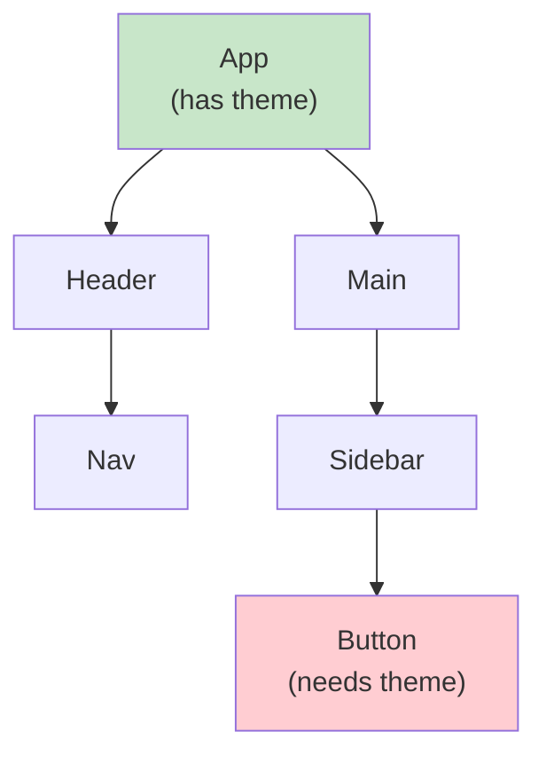
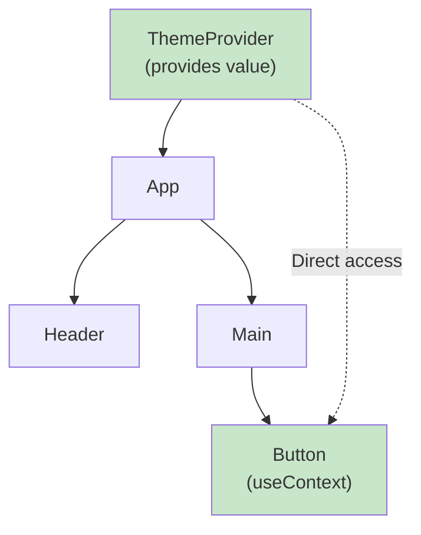

# 3.1 useContext for State Sharing

## 📚 Learning Objectives

- Understand the Context API
- Avoid prop drilling
- Create and use context with TypeScript
- Know when to use context

---

## 🔄 The Prop Drilling Problem



Without context, you must pass `theme` through every component!

---

## ✨ Context Solution



---

## 💻 Creating Context

```tsx
import { createContext, useContext, useState, ReactNode } from 'react';

// 1. Define types
interface ThemeContextType {
  theme: 'light' | 'dark';
  toggleTheme: () => void;
}

// 2. Create context
const ThemeContext = createContext<ThemeContextType | null>(null);

// 3. Create provider component
interface ThemeProviderProps {
  children: ReactNode;
}

export function ThemeProvider({ children }: ThemeProviderProps): React.ReactElement {
  const [theme, setTheme] = useState<'light' | 'dark'>('light');
  
  const toggleTheme = (): void => {
    setTheme(prev => prev === 'light' ? 'dark' : 'light');
  };
  
  return (
    <ThemeContext.Provider value={{ theme, toggleTheme }}>
      {children}
    </ThemeContext.Provider>
  );
}

// 4. Create custom hook
export function useTheme(): ThemeContextType {
  const context = useContext(ThemeContext);
  if (!context) {
    throw new Error('useTheme must be used within ThemeProvider');
  }
  return context;
}
```

---

## 📦 Using Context

```tsx
// App.tsx
import { ThemeProvider } from './ThemeContext';

function App(): React.ReactElement {
  return (
    <ThemeProvider>
      <Header />
      <Main />
    </ThemeProvider>
  );
}

// Any nested component
function ThemeButton(): React.ReactElement {
  const { theme, toggleTheme } = useTheme();
  
  return (
    <button 
      onClick={toggleTheme}
      style={{ 
        background: theme === 'dark' ? '#333' : '#fff',
        color: theme === 'dark' ? '#fff' : '#333'
      }}
    >
      Current: {theme}
    </button>
  );
}
```

---

## ✅ Best Practices

| Practice | Why |
|----------|-----|
| Create custom hook | Type safety, error handling |
| Keep context focused | One concern per context |
| Provide default values | Easier testing |
| Memoize value object | Prevent unnecessary re-renders |

---

## ⚠️ When NOT to Use Context

- Frequently changing data (use state management library)
- Props only passed 1-2 levels (just use props)
- Large apps needing state management (consider Redux/Zustand)

---

## 📝 Summary

- Context shares state without prop drilling
- Use `createContext` + `Provider` + `useContext`
- Create custom hooks for type safety
- Keep context focused on specific concerns

---

[← Back to Module 3](../README.md) | [Next: 3.2 useReducer →](../3.2-usereducer/)
