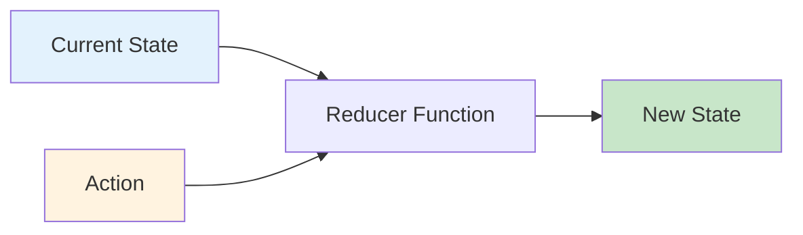

# 3.2 useReducer for Complex State

## 📚 Learning Objectives

- Understand the reducer pattern
- Use useReducer with TypeScript
- Know when to use reducer vs useState
- Handle complex state updates

---

## 🔄 Reducer Pattern



---

## 💻 Basic useReducer

```tsx
import { useReducer } from 'react';

// 1. Define types
interface State {
  count: number;
}

type Action = 
  | { type: 'INCREMENT' }
  | { type: 'DECREMENT' }
  | { type: 'RESET' }
  | { type: 'SET'; payload: number };

// 2. Create reducer
function reducer(state: State, action: Action): State {
  switch (action.type) {
    case 'INCREMENT':
      return { count: state.count + 1 };
    case 'DECREMENT':
      return { count: state.count - 1 };
    case 'RESET':
      return { count: 0 };
    case 'SET':
      return { count: action.payload };
    default:
      return state;
  }
}

// 3. Use in component
function Counter(): React.ReactElement {
  const [state, dispatch] = useReducer(reducer, { count: 0 });
  
  return (
    <div>
      <p>Count: {state.count}</p>
      <button onClick={() => dispatch({ type: 'INCREMENT' })}>+</button>
      <button onClick={() => dispatch({ type: 'DECREMENT' })}>-</button>
      <button onClick={() => dispatch({ type: 'RESET' })}>Reset</button>
      <button onClick={() => dispatch({ type: 'SET', payload: 100 })}>Set 100</button>
    </div>
  );
}
```

---

## 📦 Complex State Example

```tsx
interface Todo {
  id: number;
  text: string;
  completed: boolean;
}

interface TodoState {
  todos: Todo[];
  filter: 'all' | 'active' | 'completed';
}

type TodoAction =
  | { type: 'ADD_TODO'; payload: string }
  | { type: 'TOGGLE_TODO'; payload: number }
  | { type: 'DELETE_TODO'; payload: number }
  | { type: 'SET_FILTER'; payload: TodoState['filter'] };

function todoReducer(state: TodoState, action: TodoAction): TodoState {
  switch (action.type) {
    case 'ADD_TODO':
      return {
        ...state,
        todos: [...state.todos, {
          id: Date.now(),
          text: action.payload,
          completed: false
        }]
      };
    case 'TOGGLE_TODO':
      return {
        ...state,
        todos: state.todos.map(todo =>
          todo.id === action.payload
            ? { ...todo, completed: !todo.completed }
            : todo
        )
      };
    case 'DELETE_TODO':
      return {
        ...state,
        todos: state.todos.filter(todo => todo.id !== action.payload)
      };
    case 'SET_FILTER':
      return { ...state, filter: action.payload };
    default:
      return state;
  }
}
```

---

## ⚖️ useState vs useReducer

| useState | useReducer |
|----------|------------|
| Simple state (1-2 values) | Complex state objects |
| Independent updates | Related state updates |
| Easy to understand | Predictable with actions |
| Less boilerplate | Better for testing |

---

## 📝 Summary

- `useReducer` centralizes state logic in a reducer function
- Actions describe what happened, reducer determines how state changes
- Use for complex state with multiple sub-values
- Great for state that has complex update logic

---

[← Previous: 3.1 useContext](../3.1-usecontext/) | [Next: 3.3 useMemo & useCallback →](../3.3-usememo-usecallback/)
