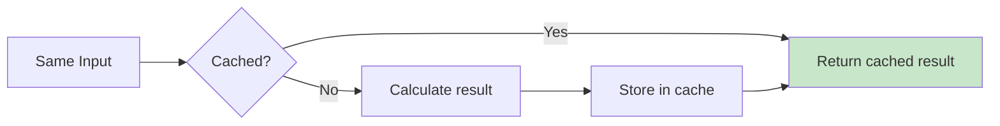

# 3.3 useMemo & useCallback

## 📚 Learning Objectives

- Understand memoization in React
- Use useMemo for expensive calculations
- Use useCallback for stable function references
- Avoid over-optimization

---

## 🧠 What is Memoization?

Caching the result of a computation to avoid recalculating it.



---

## 💻 useMemo: Memoize Values

```tsx
import { useMemo, useState } from 'react';

function ExpensiveComponent({ items }: { items: number[] }): React.ReactElement {
  const [filter, setFilter] = useState<string>('');
  
  // ✅ Only recalculates when `items` changes
  const sortedItems = useMemo(() => {
    console.log('Sorting...');
    return [...items].sort((a, b) => a - b);
  }, [items]);
  
  // ✅ Only recalculates when `sortedItems` or `filter` changes
  const total = useMemo(() => {
    return sortedItems.reduce((sum, n) => sum + n, 0);
  }, [sortedItems]);
  
  return (
    <div>
      <p>Total: {total}</p>
      <input value={filter} onChange={e => setFilter(e.target.value)} />
    </div>
  );
}
```

---

## 💻 useCallback: Memoize Functions

```tsx
import { useCallback, useState, memo } from 'react';

// Child component wrapped in memo
const Button = memo(function Button({ 
  onClick, 
  label 
}: { 
  onClick: () => void; 
  label: string; 
}): React.ReactElement {
  console.log(`Rendering ${label}`);
  return <button onClick={onClick}>{label}</button>;
});

function Parent(): React.ReactElement {
  const [count, setCount] = useState(0);
  const [text, setText] = useState('');
  
  // ✅ Stable reference - doesn't change between renders
  const increment = useCallback(() => {
    setCount(c => c + 1);
  }, []);
  
  // ❌ Would create new function every render without useCallback
  // const increment = () => setCount(c => c + 1);
  
  return (
    <div>
      <p>Count: {count}</p>
      <input value={text} onChange={e => setText(e.target.value)} />
      <Button onClick={increment} label="Increment" />
    </div>
  );
}
```

---

## ⚖️ When to Use

| Hook | Use When |
|------|----------|
| `useMemo` | Expensive calculations, derived data |
| `useCallback` | Passing callbacks to memoized children |
| Neither | Simple operations, non-memoized children |

---

## ⚠️ Don't Over-Optimize

```tsx
// ❌ Unnecessary - simple calculation
const doubled = useMemo(() => count * 2, [count]);

// ✅ Just calculate it
const doubled = count * 2;

// ❌ Unnecessary - child isn't memoized
const handleClick = useCallback(() => {}, []);
<RegularChild onClick={handleClick} />

// ✅ Only useful with memo()
const handleClick = useCallback(() => {}, []);
<MemoizedChild onClick={handleClick} />
```

---

## 📝 Summary

- `useMemo` caches computed values
- `useCallback` caches function references
- Both only useful with proper dependencies
- Don't optimize prematurely - measure first!

---

[← Previous: 3.2 useReducer](../3.2-usereducer/) | [Next: 3.4 Custom Hooks →](../3.4-custom-hooks/)
