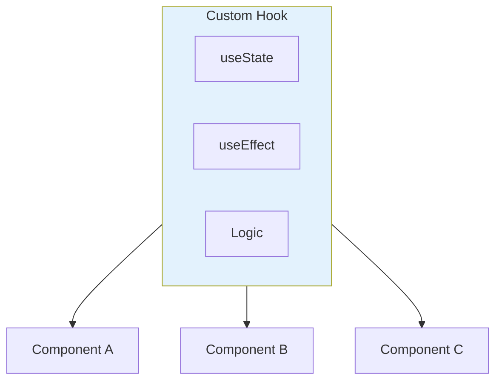

# 3.4 Custom Hooks

## 📚 Learning Objectives

- Extract reusable logic into custom hooks
- Follow hook naming conventions
- Share stateful logic between components
- Build common custom hooks

---

## 🎣 What Are Custom Hooks?

Functions that use React hooks to encapsulate reusable logic.



---

## 💻 Creating Custom Hooks

### 1. useLocalStorage

```tsx
function useLocalStorage<T>(
  key: string, 
  initialValue: T
): [T, (value: T) => void] {
  const [storedValue, setStoredValue] = useState<T>(() => {
    try {
      const item = localStorage.getItem(key);
      return item ? JSON.parse(item) : initialValue;
    } catch {
      return initialValue;
    }
  });

  const setValue = (value: T): void => {
    setStoredValue(value);
    localStorage.setItem(key, JSON.stringify(value));
  };

  return [storedValue, setValue];
}

// Usage
function App(): React.ReactElement {
  const [theme, setTheme] = useLocalStorage<'light' | 'dark'>('theme', 'light');
  return <button onClick={() => setTheme(theme === 'light' ? 'dark' : 'light')}>{theme}</button>;
}
```

### 2. useFetch

```tsx
interface FetchState<T> {
  data: T | null;
  loading: boolean;
  error: string | null;
}

function useFetch<T>(url: string): FetchState<T> {
  const [state, setState] = useState<FetchState<T>>({
    data: null,
    loading: true,
    error: null
  });

  useEffect(() => {
    let cancelled = false;
    
    fetch(url)
      .then(res => res.json())
      .then(data => {
        if (!cancelled) setState({ data, loading: false, error: null });
      })
      .catch(err => {
        if (!cancelled) setState({ data: null, loading: false, error: err.message });
      });

    return () => { cancelled = true; };
  }, [url]);

  return state;
}

// Usage
function UserProfile({ id }: { id: number }): React.ReactElement {
  const { data, loading, error } = useFetch<User>(`/api/users/${id}`);
  if (loading) return <p>Loading...</p>;
  if (error) return <p>Error: {error}</p>;
  return <p>{data?.name}</p>;
}
```

### 3. useToggle

```tsx
function useToggle(initial: boolean = false): [boolean, () => void] {
  const [value, setValue] = useState(initial);
  const toggle = useCallback(() => setValue(v => !v), []);
  return [value, toggle];
}

// Usage
function Modal(): React.ReactElement {
  const [isOpen, toggleOpen] = useToggle(false);
  return (
    <>
      <button onClick={toggleOpen}>Open Modal</button>
      {isOpen && <div className="modal">Content</div>}
    </>
  );
}
```

---

## ✅ Hook Rules

1. Name starts with `use`
2. Can call other hooks
3. Same rules as regular hooks (top level, not in conditions)
4. Return value can be any shape

---

## 📝 Summary

- Custom hooks extract reusable stateful logic
- Must start with `use` prefix
- Can compose multiple hooks together
- Make components cleaner and more focused

---

[← Previous: 3.3 useMemo & useCallback](../3.3-usememo-usecallback/) | [Next Module: 4 React 19 →](../../module-4-react19-features/)
