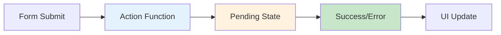

# 4.1 Actions & useActionState

## 📚 Learning Objectives

- Understand React 19's Actions concept
- Use useActionState for form handling
- Handle pending states automatically
- Implement error handling

---

## 🚀 What Are Actions?

Actions are async functions that handle form submissions and state transitions. React 19 provides first-class support for them.



---

## 💻 useActionState Hook

```tsx
import { useActionState } from 'react';

interface FormState {
  message: string;
  errors?: { email?: string };
}

async function submitForm(
  prevState: FormState,
  formData: FormData
): Promise<FormState> {
  const email = formData.get('email') as string;
  
  // Simulate API call
  await new Promise(resolve => setTimeout(resolve, 1000));
  
  if (!email.includes('@')) {
    return { message: '', errors: { email: 'Invalid email' } };
  }
  
  return { message: 'Subscribed successfully!' };
}

function NewsletterForm(): React.ReactElement {
  const [state, formAction, isPending] = useActionState(submitForm, { message: '' });
  
  return (
    <form action={formAction}>
      <input 
        name="email" 
        placeholder="Enter email"
        disabled={isPending}
      />
      {state.errors?.email && (
        <p className="error">{state.errors.email}</p>
      )}
      <button type="submit" disabled={isPending}>
        {isPending ? 'Subscribing...' : 'Subscribe'}
      </button>
      {state.message && <p className="success">{state.message}</p>}
    </form>
  );
}
```

---

## 📦 Form Action Pattern

```tsx
// The action receives FormData directly
async function createUser(
  prevState: { error?: string; success?: boolean },
  formData: FormData
) {
  const name = formData.get('name') as string;
  const email = formData.get('email') as string;
  
  try {
    await api.createUser({ name, email });
    return { success: true };
  } catch (error) {
    return { error: 'Failed to create user' };
  }
}

function CreateUserForm(): React.ReactElement {
  const [state, action, pending] = useActionState(createUser, {});
  
  return (
    <form action={action}>
      <input name="name" placeholder="Name" required />
      <input name="email" type="email" placeholder="Email" required />
      <button disabled={pending}>
        {pending ? 'Creating...' : 'Create User'}
      </button>
      {state.error && <p className="error">{state.error}</p>}
      {state.success && <p className="success">User created!</p>}
    </form>
  );
}
```

---

## ✅ Benefits of Actions

| Benefit | Description |
|---------|-------------|
| Automatic pending state | `isPending` tracks submission |
| Progressive enhancement | Works without JS |
| Error handling | Centralized in action |
| FormData | Native form data access |

---

## 📝 Summary

- Actions are async functions for form/state transitions
- `useActionState` provides state, action, and pending status
- Automatic pending state handling
- Works with native FormData

---

[← Back to Module 4](../README.md) | [Next: 4.2 useFormStatus →](../4.2-useformstatus/)
