# 4.2 useFormStatus Hook

## 📚 Learning Objectives

- Access form submission status from child components
- Create reusable submit buttons
- Handle pending states elegantly

---

## 🎯 What is useFormStatus?

`useFormStatus` lets child components access the status of their parent form's submission.

```mermaid
flowchart TD
    Form["<form action={...}>"] --> Status["useFormStatus"]
    Status --> Button["SubmitButton"]
    Status --> Spinner["LoadingSpinner"]
    
    style Form fill:#e3f2fd
    style Status fill:#fff3e0
```



---

## 💻 Basic Usage

```tsx
import { useFormStatus } from 'react-dom';

function SubmitButton(): React.ReactElement {
  const { pending, data, method, action } = useFormStatus();
  
  return (
    <button type="submit" disabled={pending}>
      {pending ? 'Submitting...' : 'Submit'}
    </button>
  );
}

// Usage in form
function ContactForm(): React.ReactElement {
  async function handleSubmit(formData: FormData) {
    await fetch('/api/contact', {
      method: 'POST',
      body: formData
    });
  }
  
  return (
    <form action={handleSubmit}>
      <input name="name" placeholder="Name" />
      <input name="email" type="email" placeholder="Email" />
      <SubmitButton />  {/* Automatically knows form status! */}
    </form>
  );
}
```

---

## 📦 useFormStatus Properties

| Property | Type | Description |
|----------|------|-------------|
| `pending` | `boolean` | Is form submitting? |
| `data` | `FormData | null` | Form data being submitted |
| `method` | `string` | HTTP method |
| `action` | `string` | Form action URL |

---

## 💡 Reusable Components

```tsx
// Reusable submit button
function LoadingButton({ 
  children, 
  loadingText = 'Loading...' 
}: { 
  children: React.ReactNode; 
  loadingText?: string;
}): React.ReactElement {
  const { pending } = useFormStatus();
  
  return (
    <button 
      type="submit" 
      disabled={pending}
      style={{ opacity: pending ? 0.7 : 1 }}
    >
      {pending ? (
        <>
          <span className="spinner" /> {loadingText}
        </>
      ) : children}
    </button>
  );
}

// Reusable field that disables during submission
function FormField({ 
  name, 
  ...props 
}: React.InputHTMLAttributes<HTMLInputElement>): React.ReactElement {
  const { pending } = useFormStatus();
  
  return <input name={name} disabled={pending} {...props} />;
}
```

---

## ⚠️ Important Notes

> [!WARNING]
> `useFormStatus` must be called from a component **inside** the form, not the form component itself!

```tsx
// ❌ Wrong - can't use in same component as form
function Form(): React.ReactElement {
  const { pending } = useFormStatus();  // Won't work!
  return <form>...</form>;
}

// ✅ Correct - use in child component
function Form(): React.ReactElement {
  return (
    <form action={...}>
      <SubmitButton />  {/* useFormStatus works here */}
    </form>
  );
}
```

---

## 📝 Summary

- `useFormStatus` accesses parent form's submission state
- Must be used in child components inside the form
- Great for reusable loading states and disabled inputs
- Returns pending, data, method, and action

---

[← Previous: 4.1 Actions](../4.1-actions-useactionstate/) | [Next: 4.3 useOptimistic →](../4.3-useoptimistic/)
