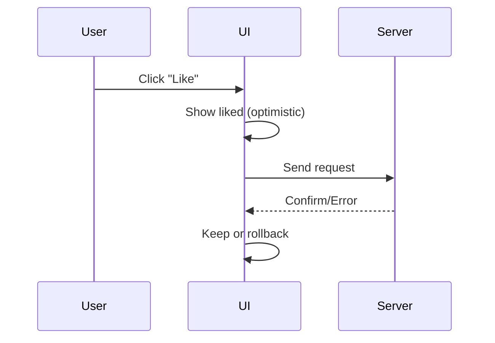

# 4.3 useOptimistic Hook

## 📚 Learning Objectives

- Implement optimistic UI updates
- Improve perceived performance
- Handle rollback on errors

---

## 🚀 What is Optimistic UI?

Show the expected result immediately, before the server confirms.



---

## 💻 useOptimistic Hook

```tsx
import { useOptimistic } from 'react';

interface Message {
  id: number;
  text: string;
  sending?: boolean;
}

function Chat(): React.ReactElement {
  const [messages, setMessages] = useState<Message[]>([]);
  
  // Optimistic state
  const [optimisticMessages, addOptimisticMessage] = useOptimistic(
    messages,
    (state, newMessage: Message) => [...state, { ...newMessage, sending: true }]
  );
  
  async function sendMessage(formData: FormData): Promise<void> {
    const text = formData.get('message') as string;
    const newMessage = { id: Date.now(), text };
    
    // Immediately show optimistic message
    addOptimisticMessage(newMessage);
    
    // Send to server
    const savedMessage = await api.sendMessage(text);
    
    // Update with real message
    setMessages(prev => [...prev, savedMessage]);
  }
  
  return (
    <div>
      {optimisticMessages.map(msg => (
        <p key={msg.id} style={{ opacity: msg.sending ? 0.7 : 1 }}>
          {msg.text} {msg.sending && '(sending...)'}
        </p>
      ))}
      <form action={sendMessage}>
        <input name="message" />
        <button>Send</button>
      </form>
    </div>
  );
}
```

---

## 📦 Like Button Example

```tsx
interface Post {
  id: number;
  likes: number;
  likedByMe: boolean;
}

function LikeButton({ post }: { post: Post }): React.ReactElement {
  const [optimisticPost, toggleLike] = useOptimistic(
    post,
    (current) => ({
      ...current,
      likes: current.likedByMe ? current.likes - 1 : current.likes + 1,
      likedByMe: !current.likedByMe
    })
  );
  
  async function handleLike(): Promise<void> {
    toggleLike(post);  // Optimistic update
    await api.toggleLike(post.id);  // Server request
  }
  
  return (
    <button onClick={handleLike}>
      {optimisticPost.likedByMe ? '❤️' : '🤍'} {optimisticPost.likes}
    </button>
  );
}
```

---

## ✅ When to Use

| Use Case | Benefit |
|----------|---------|
| Likes/favorites | Instant feedback |
| Comments | Immediate appearance |
| Form submissions | Feels responsive |
| Toggle states | No delay feeling |

---

## 📝 Summary

- `useOptimistic` shows expected result immediately
- Improves perceived performance
- Automatically handles pending visual state
- Real state updates when server confirms

---

[← Previous: 4.2 useFormStatus](../4.2-useformstatus/) | [Next: 4.4 The use API →](../4.4-use-api/)
