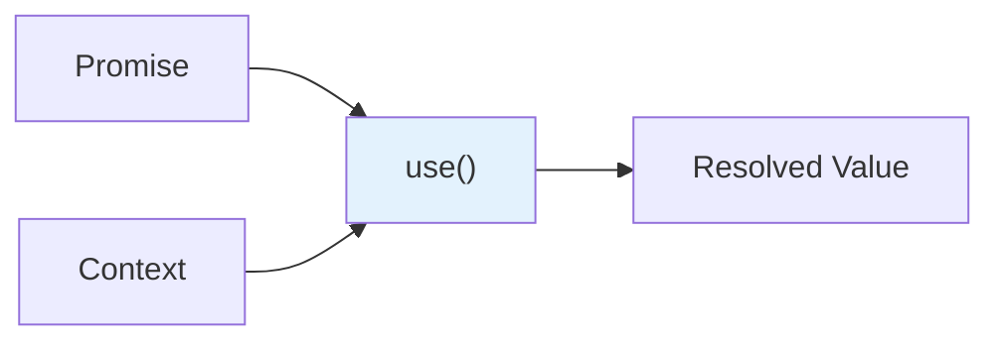

# 4.4 The `use` API

## 📚 Learning Objectives

- Read promises with the `use` hook
- Read context with `use`
- Handle loading and error states

---

## 🎯 What is `use`?

A new API to read values from resources (promises, context) during render.



---

## 💻 Reading Promises

```tsx
import { use, Suspense } from 'react';

// Create a promise (usually from data fetching)
const userPromise = fetch('/api/user').then(r => r.json());

function UserProfile(): React.ReactElement {
  // `use` will suspend until promise resolves
  const user = use(userPromise);
  
  return (
    <div>
      <h1>{user.name}</h1>
      <p>{user.email}</p>
    </div>
  );
}

// Wrap with Suspense
function App(): React.ReactElement {
  return (
    <Suspense fallback={<p>Loading...</p>}>
      <UserProfile />
    </Suspense>
  );
}
```

---

## 💻 Reading Context

```tsx
import { use, createContext } from 'react';

const ThemeContext = createContext<'light' | 'dark'>('light');

function Button(): React.ReactElement {
  // Can use `use` instead of `useContext`
  const theme = use(ThemeContext);
  
  return (
    <button className={theme}>
      Themed Button
    </button>
  );
}
```

---

## 🔄 Conditional Reading

```tsx
function UserData({ userId, showDetails }: { userId: number; showDetails: boolean }): React.ReactElement {
  // `use` can be called conditionally (unlike other hooks!)
  if (showDetails) {
    const details = use(fetchUserDetails(userId));
    return <div>{details.bio}</div>;
  }
  
  return <div>No details</div>;
}
```

---

## ⚠️ Key Differences

| Feature | useContext | use |
|---------|-----------|-----|
| Conditional calls | ❌ | ✅ |
| Read promises | ❌ | ✅ |
| Early returns | ❌ | ✅ |
| Inside loops | ❌ | ✅ |

---

## 📝 Summary

- `use` reads values from promises and context
- Can be called conditionally (unlike hooks)
- Suspends component while promise resolves
- Use with Suspense for loading states

---

[← Previous: 4.3 useOptimistic](../4.3-useoptimistic/) | [Next: 4.5 Document Metadata →](../4.5-document-metadata/)
