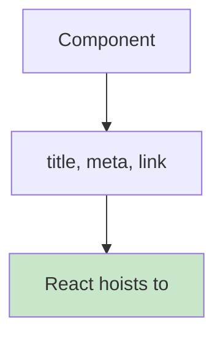

# 4.5 Document Metadata Support

## 📚 Learning Objectives

- Render metadata from components
- Use native title, meta, and link tags
- No external libraries needed

---

## 🎯 Native Metadata in React 19

React 19 hoists `<title>`, `<meta>`, and `<link>` tags to the document head automatically!



---

## 💻 Page Title

```tsx
function BlogPost({ post }: { post: Post }): React.ReactElement {
  return (
    <article>
      {/* Automatically hoisted to <head> */}
      <title>{post.title} | My Blog</title>
      
      <h1>{post.title}</h1>
      <p>{post.content}</p>
    </article>
  );
}
```

---

## 💻 Meta Tags

```tsx
function ProductPage({ product }: { product: Product }): React.ReactElement {
  return (
    <div>
      {/* SEO meta tags */}
      <title>{product.name} | Shop</title>
      <meta name="description" content={product.description} />
      <meta property="og:title" content={product.name} />
      <meta property="og:image" content={product.imageUrl} />
      
      <h1>{product.name}</h1>
      
    </div>
  );
}
```

---

## 💻 Link Tags

```tsx
function StylesheetLoader(): React.ReactElement {
  return (
    <>
      {/* Stylesheets with precedence */}
      <link rel="stylesheet" href="/base.css" precedence="default" />
      <link rel="stylesheet" href="/theme.css" precedence="high" />
      
      {/* Preload hints */}
      <link rel="preload" href="/fonts/inter.woff2" as="font" />
      
      <div>Content</div>
    </>
  );
}
```

---

## 📦 Complete Example

```tsx
function Dashboard(): React.ReactElement {
  const { user, notifications } = useUserData();
  
  return (
    <>
      {/* Document metadata */}
      <title>Dashboard | MyApp</title>
      <meta name="description" content="Your personal dashboard" />
      <link rel="icon" href="/favicon.ico" />
      
      {/* Page content */}
      <header>
        <h1>Welcome, {user.name}</h1>
        <span>{notifications.length} notifications</span>
      </header>
      <main>
        <DashboardWidgets />
      </main>
    </>
  );
}
```

---

## ✅ Benefits

| Before (react-helmet) | React 19 |
|-----------------------|----------|
| Extra dependency | Built-in |
| Special components | Native tags |
| Complex setup | Just works |

---

## 📝 Summary

- React 19 natively supports `<title>`, `<meta>`, `<link>` in components
- Tags are automatically hoisted to `<head>`
- No need for react-helmet or similar libraries
- Use `precedence` for stylesheet ordering

---

[← Previous: 4.4 use API](../4.4-use-api/) | [Next Module: 5 Server Components →](../../module-5-server-components/)
