# 5.1 Introduction to React Server Components

## 📚 Learning Objectives

- Understand what Server Components are
- Know the difference vs Client Components
- Learn the benefits and trade-offs

---

## 🌐 What Are Server Components?

Components that render on the server, sending only HTML to the client.

```mermaid
flowchart LR
    subgraph Server["🖥️ Server"]
        SC["Server Component"]
        DB["Database"]
        SC --> DB
    end
    
    subgraph Client["🌐 Client"]
        HTML["HTML"]
        CC["Client Component"]
    end
    
    SC -->|"HTML only"| HTML
    CC -->|"JS bundle"| HTML
    
    style Server fill:#e3f2fd
    style Client fill:#fff3e0
```



---

## ⚖️ Server vs Client Components

| Feature | Server Component | Client Component |
|---------|-----------------|------------------|
| Runs on | Server only | Client (+ server for SSR) |
| Bundle size | Zero JS | Included in bundle |
| Data access | Direct DB/API | Via fetch |
| Interactivity | ❌ No hooks | ✅ Full interactivity |
| State | ❌ No useState | ✅ Full state |
| Events | ❌ No onClick | ✅ Full events |

---

## 💻 Example

```tsx
// Server Component (default in App Router)
// Can access database directly!
async function UserList(): Promise<React.ReactElement> {
  const users = await db.users.findMany();  // Direct DB access
  
  return (
    <ul>
      {users.map(user => (
        <li key={user.id}>{user.name}</li>
      ))}
    </ul>
  );
}

// Client Component (needs directive)
'use client';

import { useState } from 'react';

function Counter(): React.ReactElement {
  const [count, setCount] = useState(0);  // Needs client
  
  return (
    <button onClick={() => setCount(c => c + 1)}>
      Count: {count}
    </button>
  );
}
```

---

## ✅ Benefits

| Benefit | Description |
|---------|-------------|
| Smaller bundles | No JS for server components |
| Direct data access | Query DB without API |
| Better performance | Less client-side work |
| SEO | Content rendered on server |

---

## ⚠️ Limitations

- No React hooks (useState, useEffect)
- No browser APIs
- No event handlers
- No context (as consumer)

---

## 📝 Summary

- Server Components run on server, send HTML
- No JavaScript sent to client for them
- Use for data fetching, non-interactive content
- Client Components for interactivity

---

[← Back to Module 5](../README.md) | [Next: 5.2 Directives →](../5.2-directives/)
