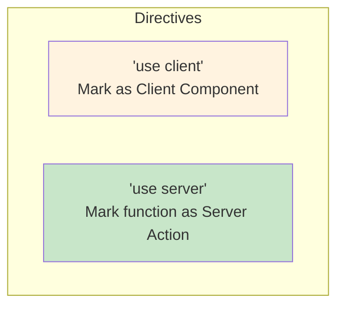
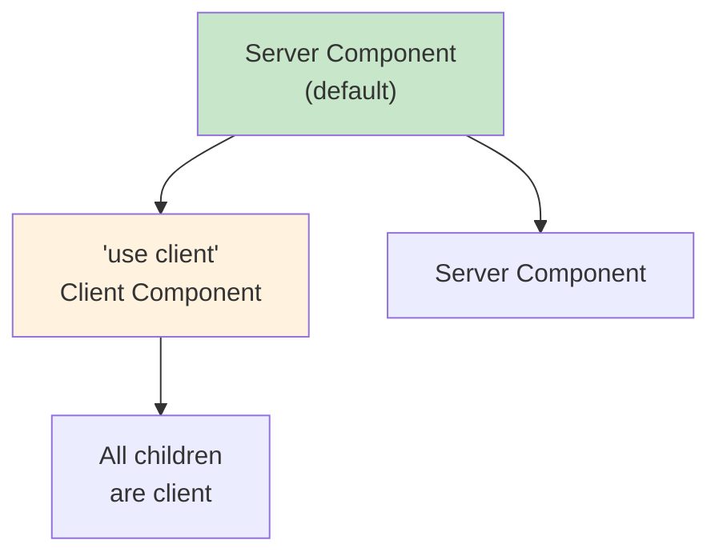

# 5.2 "use client" & "use server" Directives

## 📚 Learning Objectives

- Understand the two directive types
- Know when to use each
- Handle the component boundary

---

## 🎯 The Directives



---

## 💻 "use client"

Marks a component (and its imports) as client-side.

```tsx
'use client';  // Must be first line!

import { useState } from 'react';

export function InteractiveWidget(): React.ReactElement {
  const [active, setActive] = useState(false);
  
  return (
    <button onClick={() => setActive(!active)}>
      {active ? 'Active' : 'Inactive'}
    </button>
  );
}
```

---

## 💻 "use server"

Marks a function as a Server Action.

```tsx
'use server';

export async function createUser(formData: FormData): Promise<void> {
  const name = formData.get('name') as string;
  await db.users.create({ data: { name } });
}
```

---

## 🔄 Component Boundary



---

## 💡 Pattern: Server + Client

```tsx
// page.tsx (Server Component)
import { InteractiveCounter } from './Counter';

async function Dashboard(): Promise<React.ReactElement> {
  const stats = await getStats();  // Server-side
  
  return (
    <div>
      <h1>Dashboard</h1>
      <p>Total: {stats.total}</p>
      <InteractiveCounter />  {/* Client Component */}
    </div>
  );
}

// Counter.tsx
'use client';

export function InteractiveCounter(): React.ReactElement {
  const [count, setCount] = useState(0);
  return <button onClick={() => setCount(c + 1)}>{count}</button>;
}
```

---

## ✅ Best Practices

| Practice | Why |
|----------|-----|
| Default to Server | Smaller bundles |
| Add 'use client' only when needed | For hooks, events |
| Keep client components small | Less JS to ship |
| Pass data as props | From server to client |

---

## 📝 Summary

- `'use client'` for interactive components
- `'use server'` for server-side functions
- Boundary: once client, children are client
- Minimize client components for performance

---

[← Previous: 5.1 Intro to RSC](../5.1-intro-rsc/) | [Next: 5.3 Server Actions →](../5.3-server-actions/)
