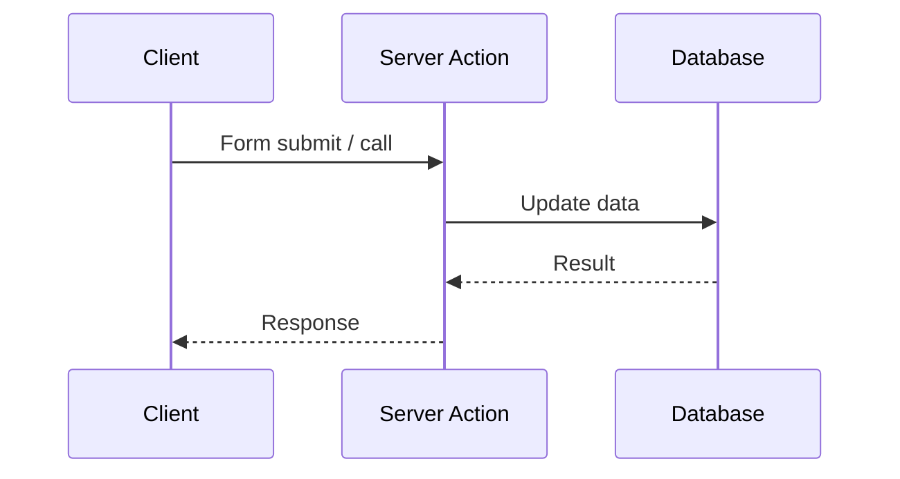

# 5.3 Server Actions

## 📚 Learning Objectives

- Create and use Server Actions
- Handle form submissions
- Understand security implications

---

## 🎯 What Are Server Actions?

Async functions that run on the server, triggered from client.



---

## 💻 Inline Server Action

```tsx
// In a Server Component
async function TodoForm(): Promise<React.ReactElement> {
  async function addTodo(formData: FormData): Promise<void> {
    'use server';  // Marks this as Server Action
    
    const text = formData.get('text') as string;
    await db.todos.create({ data: { text } });
  }
  
  return (
    <form action={addTodo}>
      <input name="text" placeholder="New todo" />
      <button type="submit">Add</button>
    </form>
  );
}
```

---

## 💻 Separate Actions File

```tsx
// actions.ts
'use server';

export async function createPost(formData: FormData): Promise<void> {
  const title = formData.get('title') as string;
  const content = formData.get('content') as string;
  
  await db.posts.create({
    data: { title, content }
  });
}

export async function deletePost(id: number): Promise<void> {
  await db.posts.delete({ where: { id } });
}

// Component
import { createPost } from './actions';

function PostForm(): React.ReactElement {
  return (
    <form action={createPost}>
      <input name="title" />
      <textarea name="content" />
      <button>Create Post</button>
    </form>
  );
}
```

---

## 💻 With useActionState

```tsx
'use server';

export async function submitFeedback(
  prevState: { success: boolean; message: string },
  formData: FormData
): Promise<{ success: boolean; message: string }> {
  const email = formData.get('email') as string;
  const feedback = formData.get('feedback') as string;
  
  try {
    await db.feedback.create({ data: { email, feedback } });
    return { success: true, message: 'Thank you!' };
  } catch {
    return { success: false, message: 'Failed to submit' };
  }
}
```

---

## ⚠️ Security Notes

> [!WARNING]
> Server Actions receive data from clients - always validate!

```tsx
'use server';

import { z } from 'zod';

const schema = z.object({
  email: z.string().email(),
  message: z.string().min(10)
});

export async function sendMessage(formData: FormData): Promise<void> {
  const result = schema.safeParse({
    email: formData.get('email'),
    message: formData.get('message')
  });
  
  if (!result.success) {
    throw new Error('Invalid input');
  }
  
  // Safe to use result.data
}
```

---

## 📝 Summary

- Server Actions are async functions on server
- Use for mutations (create, update, delete)
- Work with forms via `action` prop
- Always validate input for security

---

[← Previous: 5.2 Directives](../5.2-directives/) | [Next Module: 6 Performance →](../../module-6-performance/)
