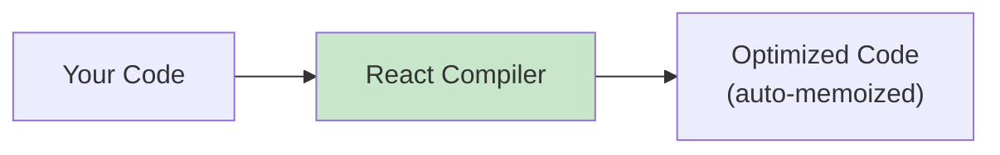

# 6.1 React Compiler (Experimental)

## 📚 Learning Objectives

- Understand what React Compiler does
- Know the optimization it provides
- Learn how to enable it

---

## 🚀 What is React Compiler?

An experimental build-time optimizer that automatically adds memoization.



---

## 💡 What It Does

| Before (Manual) | After (Compiler) |
|-----------------|------------------|
| `useMemo()` everywhere | Automatic |
| `useCallback()` everywhere | Automatic |
| `memo()` components | Automatic |
| Easy to forget | Never forget |

---

## 💻 Example

```tsx
// Your code
function ProductList({ products }: { products: Product[] }): React.ReactElement {
  const sorted = products.sort((a, b) => a.price - b.price);
  
  return (
    <ul>
      {sorted.map(p => (
        <ProductCard key={p.id} product={p} />
      ))}
    </ul>
  );
}

// Compiler automatically adds memoization where beneficial
// You don't need to change your code!
```

---

## ⚙️ Enabling React Compiler

```bash
# Install
npm install babel-plugin-react-compiler

# babel.config.js
module.exports = {
  plugins: [
    ['babel-plugin-react-compiler', {
      // options
    }]
  ]
}
```

---

## ⚠️ Current Status

> [!NOTE]
> React Compiler is experimental. Features may change.

- Works with React 19
- Production use at Meta
- Gradually rolling out

---

## 📝 Summary

- React Compiler auto-optimizes your code
- Eliminates need for manual useMemo/useCallback
- Experimental but production-ready at scale
- No code changes needed!

---

[← Back to Module 6](../README.md) | [Next: 6.2 Asset Loading →](../6.2-asset-loading/)
