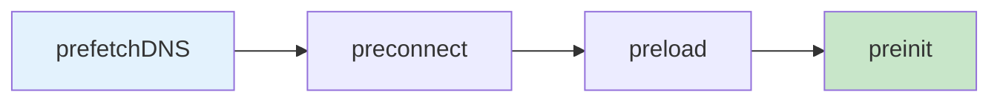

# 6.2 Asset Loading & Preloading

## 📚 Learning Objectives

- Use React 19's preloading APIs
- Optimize resource loading
- Improve page performance

---

## 🚀 React 19 Resource APIs

```tsx
import { prefetchDNS, preconnect, preload, preinit } from 'react-dom';

function App(): React.ReactElement {
  // Prefetch DNS for external domain
  prefetchDNS('https://api.example.com');
  
  // Preconnect (DNS + TCP + TLS)
  preconnect('https://fonts.googleapis.com');
  
  // Preload specific resource
  preload('/fonts/inter.woff2', { as: 'font' });
  
  // Preinit (preload + execute)
  preinit('/scripts/analytics.js', { as: 'script' });
  
  return <div>...</div>;
}
```

---

## 📊 Loading Priority



---

## 💻 Stylesheet Loading

```tsx
function Component(): React.ReactElement {
  return (
    <>
      {/* Stylesheets with precedence control */}
      <link rel="stylesheet" href="/base.css" precedence="default" />
      <link rel="stylesheet" href="/theme.css" precedence="high" />
      
      <div>Content styled correctly!</div>
    </>
  );
}
```

---

## 💻 Font Preloading

```tsx
function Layout(): React.ReactElement {
  return (
    <>
      <link
        rel="preload"
        href="/fonts/inter-var.woff2"
        as="font"
        type="font/woff2"
        crossOrigin="anonymous"
      />
      <div>Text with preloaded font</div>
    </>
  );
}
```

---

## ✅ Best Practices

| Resource | API | When |
|----------|-----|------|
| External APIs | `prefetchDNS` | Known external calls |
| CDNs | `preconnect` | Multiple resources |
| Critical fonts | `preload` | Above-the-fold text |
| Analytics | `preinit` | Non-blocking scripts |

---

## 📝 Summary

- React 19 has built-in resource loading APIs
- Use `prefetchDNS` → `preconnect` → `preload` → `preinit`
- Stylesheets support `precedence` for ordering
- Improves page load performance

---

[← Previous: 6.1 React Compiler](../6.1-react-compiler/) | [Next: 6.3 Optimization Patterns →](../6.3-optimization-patterns/)
