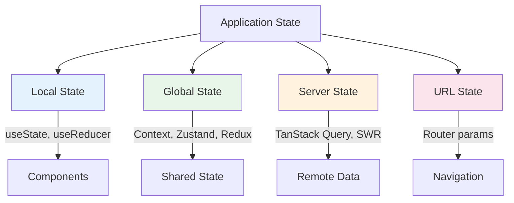
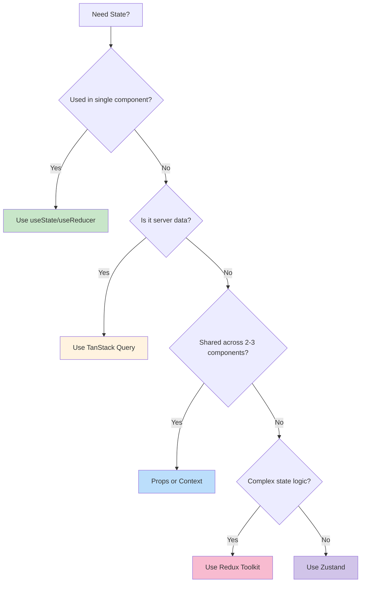

# 7.1 State Management Overview

## 📚 Learning Objectives

- Understand when to use different state solutions
- Compare client state vs server state
- Learn the decision framework for choosing state management

---

## 🧠 Types of State



---

## 📊 State Types Comparison

| Type | Examples | Solutions |
|------|----------|-----------|
| **Local** | Form inputs, toggles, UI state | `useState`, `useReducer` |
| **Global** | User auth, theme, cart | Context, Zustand, Redux |
| **Server** | API data, cache | TanStack Query, SWR |
| **URL** | Filters, pagination | Router, searchParams |

---

## 🤔 Decision Framework



---

## ✅ When to Use Each

### useState / useReducer
```tsx
// Perfect for: Local component state
function Counter() {
  const [count, setCount] = useState(0);
  return <button onClick={() => setCount(c => c + 1)}>{count}</button>;
}
```

### React Context
```tsx
// Perfect for: Theme, auth, localization (rarely changing)
const ThemeContext = createContext<'light' | 'dark'>('light');
```

### Zustand
```tsx
// Perfect for: Simple global state without boilerplate
const useStore = create((set) => ({
  count: 0,
  increment: () => set((state) => ({ count: state.count + 1 })),
}));
```

### Redux Toolkit
```tsx
// Perfect for: Complex apps with strict patterns needed
const counterSlice = createSlice({
  name: 'counter',
  initialState: { value: 0 },
  reducers: {
    increment: (state) => { state.value += 1; },
  },
});
```

### TanStack Query
```tsx
// Perfect for: Server data with caching
const { data, isLoading } = useQuery({
  queryKey: ['users'],
  queryFn: () => fetch('/api/users').then(r => r.json()),
});
```

---

## 📝 Summary

- **Local state**: `useState` / `useReducer`
- **Theme/Auth**: React Context
- **Simple global**: Zustand
- **Complex enterprise**: Redux Toolkit
- **Server data**: TanStack Query

---

[← Back to Module 7](../README.md) | [Next: 7.2 Zustand →](../7.2-zustand/)
