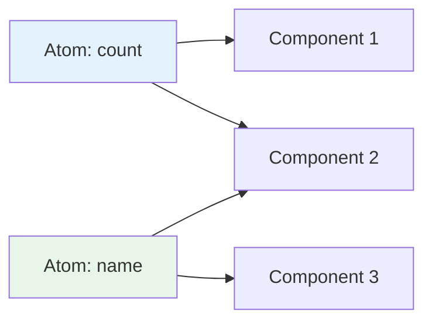

# 7.5 Jotai & Recoil

## 📚 Learning Objectives

- Understand atomic state management
- Use Jotai for simple atom-based state
- Understand Recoil's approach
- Choose between Jotai and Recoil

---

## 🧠 What is Atomic State?

Atoms are independent pieces of state that can be composed.



---

## 💻 Jotai Basics

```bash
npm install jotai
```

```tsx
import { atom, useAtom, useAtomValue, useSetAtom } from 'jotai';

// Create atoms
const countAtom = atom(0);
const doubleCountAtom = atom((get) => get(countAtom) * 2);

// Usage
function Counter() {
  const [count, setCount] = useAtom(countAtom);
  const doubleCount = useAtomValue(doubleCountAtom); // Read-only
  
  return (
    <div>
      <p>Count: {count}</p>
      <p>Double: {doubleCount}</p>
      <button onClick={() => setCount(c => c + 1)}>+</button>
    </div>
  );
}
```

---

## 📦 Jotai with Async

```tsx
import { atom, useAtom } from 'jotai';

// Async atom
const userAtom = atom(async () => {
  const res = await fetch('/api/user');
  return res.json();
});

// Derived async atom
const userNameAtom = atom(async (get) => {
  const user = await get(userAtom);
  return user.name;
});

// Usage with Suspense
function UserName() {
  const [name] = useAtom(userNameAtom);
  return <span>{name}</span>;
}

function App() {
  return (
    <Suspense fallback="Loading...">
      <UserName />
    </Suspense>
  );
}
```

---

## 🔄 Jotai Write Atoms

```tsx
// Atom with custom write logic
const todoAtom = atom<Todo[]>([]);

const addTodoAtom = atom(
  null, // no read
  (get, set, text: string) => {
    const todos = get(todoAtom);
    set(todoAtom, [
      ...todos,
      { id: Date.now().toString(), text, completed: false },
    ]);
  }
);

// Usage
function AddTodo() {
  const addTodo = useSetAtom(addTodoAtom);
  
  return (
    <button onClick={() => addTodo('New todo')}>
      Add Todo
    </button>
  );
}
```

---

## 📦 Recoil Basics

```bash
npm install recoil
```

```tsx
import { RecoilRoot, atom, useRecoilState, useRecoilValue, selector } from 'recoil';

// Atoms
const countState = atom({
  key: 'countState',
  default: 0,
});

// Selectors (derived state)
const doubleCountState = selector({
  key: 'doubleCountState',
  get: ({ get }) => get(countState) * 2,
});

// Provider
function App() {
  return (
    <RecoilRoot>
      <Counter />
    </RecoilRoot>
  );
}

// Usage
function Counter() {
  const [count, setCount] = useRecoilState(countState);
  const doubleCount = useRecoilValue(doubleCountState);
  
  return (
    <div>
      <p>Count: {count}</p>
      <p>Double: {doubleCount}</p>
      <button onClick={() => setCount(c => c + 1)}>+</button>
    </div>
  );
}
```

---

## ⚖️ Jotai vs Recoil

| Feature | Jotai | Recoil |
|---------|-------|--------|
| **Bundle Size** | ~3KB | ~20KB |
| **Provider** | Optional | Required |
| **Keys** | Optional | Required |
| **API** | Simpler | More features |
| **Debugging** | Basic | Better DevTools |

---

## 📝 Summary

- Atoms are composable state units
- Jotai is minimal and provider-optional
- Recoil offers more debugging features
- Use for granular component-level state

---

[← Back to Module 7](../README.md)
