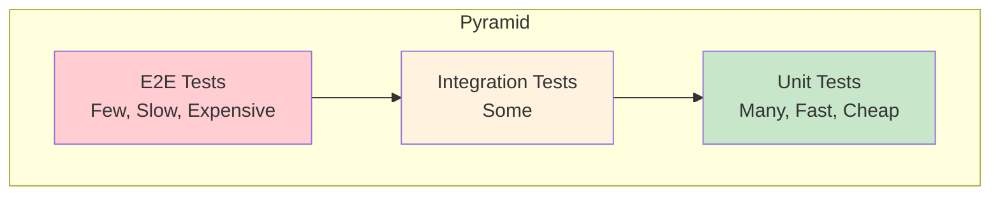

# 8.1 Testing Fundamentals

## 📚 Learning Objectives

- Understand the testing pyramid
- Know what to test and what not to test
- Set up a testing environment
- Write your first test

---

## 🔺 The Testing Pyramid



| Type | Speed | Confidence | Quantity |
|------|-------|------------|----------|
| **Unit** | Fast | Low | Many |
| **Integration** | Medium | Medium | Some |
| **E2E** | Slow | High | Few |

---

## 🎯 What to Test

### ✅ DO Test
- User interactions (clicks, typing)
- Conditional rendering
- Data transformations
- Error states
- Accessibility

### ❌ DON'T Test
- Implementation details
- Third-party libraries
- CSS styling
- Console logs

---

## 🛠️ Setup with Vitest

```bash
npm install -D vitest @testing-library/react @testing-library/jest-dom jsdom
```

```ts
// vite.config.ts
import { defineConfig } from 'vite';
import react from '@vitejs/plugin-react';

export default defineConfig({
  plugins: [react()],
  test: {
    globals: true,
    environment: 'jsdom',
    setupFiles: './src/test/setup.ts',
  },
});
```

```ts
// src/test/setup.ts
import '@testing-library/jest-dom';
```

---

## 💻 First Test

```tsx
// src/components/Button.tsx
interface ButtonProps {
  onClick: () => void;
  children: React.ReactNode;
}

export function Button({ onClick, children }: ButtonProps) {
  return <button onClick={onClick}>{children}</button>;
}

// src/components/Button.test.tsx
import { render, screen, fireEvent } from '@testing-library/react';
import { describe, it, expect, vi } from 'vitest';
import { Button } from './Button';

describe('Button', () => {
  it('renders children text', () => {
    render(<Button onClick={() => {}}>Click me</Button>);
    expect(screen.getByText('Click me')).toBeInTheDocument();
  });

  it('calls onClick when clicked', () => {
    const handleClick = vi.fn();
    render(<Button onClick={handleClick}>Click me</Button>);
    
    fireEvent.click(screen.getByText('Click me'));
    
    expect(handleClick).toHaveBeenCalledTimes(1);
  });
});
```

---

## 📝 Summary

- Follow the testing pyramid
- Test behavior, not implementation
- Use Vitest for fast testing
- RTL for component tests

---

[← Back to Module 8](../README.md) | [Next: 8.2 Vitest →](../8.2-vitest/)
